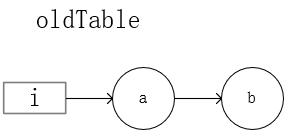

# ConcurrentHashMap阅读笔记

## HashMap多线程下出现的问题

### JDK1.7

1.7多线程put操作下会出现**死循环**。主要问题出在扩容时把旧数组键值对transfer到新数组的函数上采用了**头插法**。

```java
void resize(int newCapacity) {   //传入新的容量
    Entry[] oldTable = table;    //引用扩容前的Entry数组
    int oldCapacity = oldTable.length;         
    if (oldCapacity == MAXIMUM_CAPACITY) {  //扩容前的数组大小如果已经达到最大(2^30)了
        threshold = Integer.MAX_VALUE; //修改阈值为int的最大值(2^31-1)，这样以后就不会扩容了
        return;
    } 
    Entry[] newTable = new Entry[newCapacity];  //初始化一个新的Entry数组
    transfer(newTable);                         //！！将数据转移到新的Entry数组里
    table = newTable;                           //HashMap的table属性引用新的Entry数组
    threshold = (int)(newCapacity * loadFactor);//修改阈值
}

/**
 * Transfers all entries from current table to newTable. 
 */
void transfer(Entry[] newTable, boolean rehash) {
    int newCapacity = newTable.length;
    //外层循环，用于寻找table中不同下标的所有元素e
    for (Entry<K,V> e : table) {
        //内层循环, 用于处理table中某个桶为链表的情况
        while(null != e) {
            //代码1处
            Entry<K,V> next = e.next;
            if (rehash) {
                e.hash = null == e.key ? 0 : hash(e.key);
            }
            int i = indexFor(e.hash, newCapacity);
            //代码2处
            e.next = newTable[i];
            //代码3处
            newTable[i] = e;
            //代码4处
            e = next;
        } 
    }
}
```

我们假设在旧数组某一个下标上有元素a,b，且元素a和b在经过扩容后的下标i相同。



线程1首先执行，执行到**代码1处**结束，此时的执行结果：`e = a, next = b`；

线程2开始执行：

```Java
首轮循环：e = a, next = b, a.next = null(此时新数组[i]下标处为空), newTable[i] = a, e = b;
二轮循环：e = b, next = null, b.next = newTable[i] = a, newTable[i] = b, e = null
```

线程2执行结束，此时newTable[i]处为：


线程1再继续执行，此时`e = a, next = b`:

> 这次需要注意的是newTable是在resize()方法中new出来的局部变量，属于线程私有；
>
> 而Node和table是实例变量，属于线程共享。

- 首轮循环：

  代码2：`e.next = newTable[i]`，即a.next = null

  > newTable是线程私有，所以此时newTable[i]为null

  代码3：`newTable[i] = e;`，即 newTable[i] = a

  代码4：`e = next;` 即 e = b

  

- 二轮循环：此时 e = b

  代码1：`Entry<K,V> next = e.next;` 即 next = a

  > 线程2已经修改b.next = a，node是类变量，线程共享

  代码2：`e.next = newTable[i]`，即b.next = a

  代码3：`newTable[i] = e;`，即 newTable[i] = b

  代码4：`e = next;` 即 e = a

  

- 三轮循环：此时 e = a

  代码1：`Entry<K,V> next = e.next;` 即 next = null

  代码2：`e.next = newTable[i]`，即**a.next = b，环化问题！！**

  代码3：`newTable[i] = e;`，即 newTable[i] = a

  代码4：`e = next;` 即 e = null

  

一句话总结：头插法导致插入顺序和原顺序相反，多线程下造成了指向混乱，最终出现了链表环化问题。

> 线程1在遍历完oldTable中的b之后应该next为null，但由于线程2改变了b.next = a，所以第三轮newTable为e = a, a.next = b即把已经存在于newTable中的a结点头插入链表，导致环化。

### JDK 1.8

JDK1.8改头插法为尾插法，不再存在链表环化问题，但多线程下仍然存在**数据丢失**等问题。

## ConcurrentHashMap

