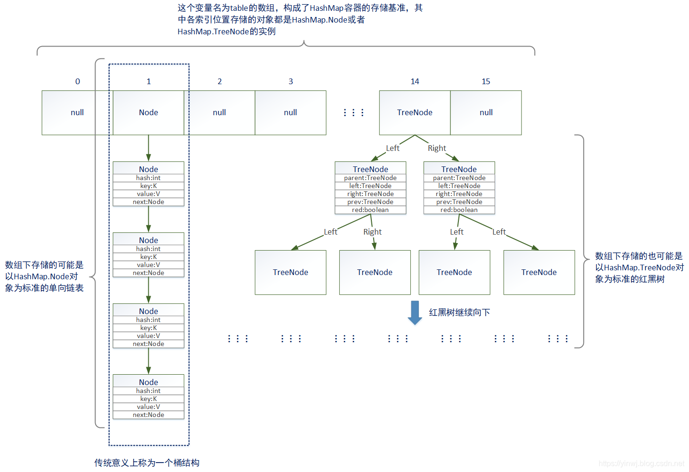

# HashMap笔记

## 前导知识

### 哈希函数

hash(散列函数)：将任意长度的输入通过散列算法变成(映射到)固定长度的输出。

 - 该映射是一种压缩映射，即输出空间远**小于**输入空间，不同的输入可能会hash成相同输出，也就是常见的**哈希冲突**问题。
 - 好的哈希函数应该保证**哈希计算简单**，同时尽量避免**哈希冲突**，保证**散列地址均匀**。
 - 已知k，求hash(k)很容易；但已知hash(k)，逆向求k很难，hash函数的该性质被广泛用于安全领域。
 - 存在k1 ≠ k2，hash(k1) = hash(k2)，该现象称为哈希冲突；但**不存在** hash(k1) ≠ hash(k2)，k1 = k2，即两个不同的hash值一定对应两个不同的原始值，这是由哈希函数的确定性得到的。
 - 常见的**哈希冲突解决策略**有（以哈希表举例）：
	- 开放定址法：按照某种策略去寻找下一个没有被占用的地址。具体策略有**线性探测**(往后+1)，**再平方探测**，**伪随机探测**等等。
	- 再散列函数法：再次哈希上次得到的哈希值。
	- 链地址法：对于相同的hash值，在当前存储区域建立一个链表，用于存储相同哈希值的元素。
### 哈希表

顾名思义，哈希表就是基于哈希算法构造的容器，它通过把key值 hash到表中的某个位置来存储该元素。由于需要在指定存储位置上进行元素的存储，所以哈希表一般采用数组作为其实现方式（基于数组根据下标能够立刻获得对应元素的特性）。
在哈希表中，当我们要进行增删改查的操作时，只需要将当前元素的key值  通过哈希函数映射到数值中的某个存储位置，通过数组下标一次定位即可完成相应操作。
可以简单认为 **存储位置(下标) = f(关键字)**。


## HashMap

### 基本介绍

HashMap：以键值对存储元素的数据结构。其主干是一个**Node数组**，每一个`Node`(也叫`Entry`）包含一个键值对，数组的每个元素为一个node/链表/红黑树。
 - `hashmap`的`key`可以为`null`，但不可以重复。
 - `hashmap`的`key`和`value`都可以为`null`，`hashtable`不允许空值，除此之外`hashtable`还是线程安全的。
 - `hashmap`的存储是无序的，
 - `hashmap`是线程不安全的，针对线程安全的应用场景使用`concurrentHashMap`。
    
## 源码解析

### 基本变量
- hashmap域值

```java
/**
 * 默认数组的初始化容量16，必须为2的次幂。
 * The default initial capacity - MUST be a power of two.
 */
static final int DEFAULT_INITIAL_CAPACITY = 1 << 4; // aka 16

/** 
 * 数组的最大容量，用于构造函数显式申明数组初始化容量时，最大为2^30.
 * The maximum capacity, used if a higher value is implicitly specified by either of the constructors with arguments.
 * MUST be a power of two <= 1<<30.
 */
static final int MAXIMUM_CAPACITY = 1 << 30;

/** 
 * 默认的装载因子，loadFactor = size/capacity, size为node的数量，loadFactor可以 ＞ 1.
 * The load factor used when none specified in constructor.
 */
static final float DEFAULT_LOAD_FACTOR = 0.75f;

/**
 * 桶的树化阈值，即一个链表的长度大于8时，把这个链表转为红黑树。
 * The bin count threshold for using a tree rather than list for a bin. 
 */
static final int TREEIFY_THRESHOLD = 8;

/** 
 * 桶的反树化阈值，即当一个红黑树中结点少于6个时，红黑树转回链表。
 * The bin count threshold for untreeifying a (split) bin during a resize operation.
 */
static final int UNTREEIFY_THRESHOLD = 6;

/**
 * hashMap的主干结构：Node数组
 * The table, initialized on first use, and resized as necessary. When allocated, length is always a power of two.
 */
transient Node<K,V>[] table;

/**
 * 存储所有Node(Entry)结点的引用的Set集合，可以理解为缓存。
 * Holds cached entrySet(). 
 */
transient Set<Map.Entry<K,V>> entrySet;

/**
 * 容器中键值对的数量，区分于数组的capacity.
 * The number of key-value mappings contained in this map.
 */
transient int size;

/**
 * 容器被结构性改变的次数
 * The number of times this HashMap has been structurally modified
 * This field is used to make iterators on Collection-views of the HashMap fail-fast.  (See ConcurrentModificationException).
 */
transient int modCount;

/**
 * 下一次数组扩容的门槛，threshold = capacity * loadFactor.
 * 当 size > thresshold 即 容器中键值对数量超过阈值时，需要扩容。
 * The next size value at which to resize (capacity * load factor).
 */
 int threshold;
 
/**
 * 装载因子
 * The load factor for the hash table.
 */
final float loadFactor;
```

 - `Node(Entry)`对象 
	
	```java
    /**
    * 键值对的存储实现形式，其中包含key, value以及指向下一结点的next指针。
    * Basic hash bin node, used for most entries. 
    */
    static class Node<K,V> implements Map.Entry<K,V> {
        final int hash;		// hash = hash(key),hash()方法将在之后讲解到
        final K key;		
        V value;			
        Node<K,V> next;		//next指针
			
        //重写了hashcode()方法.
        //定义Node.hashcode = key.hashCode 异或 value.hashcode
        public final int hashCode() {
            return Objects.hashCode(key) ^ Objects.hashCode(value);
        }
        
        //setValue会返回旧value
        public final V setValue(V newValue) {
            V oldValue = value;
            value = newValue;
            return oldValue;
        }
	
        //重写了hashcode()方法，自然也要重写equals()方法与与之匹配
        public final boolean equals(Object o) {
            //如果内存起始地址相同，则认为两个对象相等.
            if (o == this)
                return true;
            //否则若o是Entry对象，比较k-v对的 k 与 v 是否相等
            if (o instanceof Map.Entry) {
                Map.Entry<?,?> e = (Map.Entry<?,?>)o;
                if (Objects.equals(key, e.getKey()) &&
                    Objects.equals(value, e.getValue()))
                    return true;
            }
            return false;
        }
    }
   ```
 ### 构造函数
需要注意的是，Node数组并不是在构造函数中去new出来(除去形参为map的构造函数)，而是在进行**put()操作**时才被创建出来，构造函数主要负责`initialCapacity`和`loadFactor`的**赋值操作**。
```java
//空构造函数，使用默认的初始化容量和装载因子
public HashMap() {
    this.loadFactor = DEFAULT_LOAD_FACTOR; // all other fields defaulted
}
    
//指定了数组的初始容量
public HashMap(int initialCapacity) {
    this(initialCapacity, DEFAULT_LOAD_FACTOR);
}
    
//将另一个Map对象转为Hashmap对象
public HashMap(Map<? extends K, ? extends V> m) {
    this.loadFactor = DEFAULT_LOAD_FACTOR;
    putMapEntries(m, false);
}

final void putMapEntries(Map<? extends K, ? extends V> m, boolean evict) {
    //s为键值对的数量
    int s = m.size();
    //形参m中有键值对
    if (s > 0) {
        // hashMap还未初始化
        if (table == null) { // pre-size
            //计算threshold 并初始化hashmap的table
            float ft = ((float)s / loadFactor) + 1.0F;
            int t = ((ft < (float)MAXIMUM_CAPACITY) ? (int)ft : MAXIMUM_CAPACITY);
            if (t > threshold)
                threshold = tableSizeFor(t);
        }
        //形参m中的键值对数量大于threshold
        else if (s > threshold)
            resize();
        //循环遍历吧键值对放入hashmap中
        for (Map.Entry<? extends K, ? extends V> e : m.entrySet()) {
            K key = e.getKey();
            V value = e.getValue();
            putVal(hash(key), key, value, false, evict);
        }
    }
}
    
//指定了初始容量和装载因子的构造函数
public HashMap(int initialCapacity, float loadFactor) {
    //进行两个形参的校验操作
    if (initialCapacity < 0)
        throw new IllegalArgumentException("Illegal initial capacity: " + initialCapacity);
    if (initialCapacity > MAXIMUM_CAPACITY)
        initialCapacity = MAXIMUM_CAPACITY;
    if (loadFactor <= 0 || Float.isNaN(loadFactor))
        throw new IllegalArgumentException("Illegal load factor: " + loadFactor);
    this.loadFactor = loadFactor;
    
    //tableSizeFor()用于返回 大于等于initialCapacity的最小二进制数
    //比如 initialCapacity = 14 则返回16.
    //此处将得到的值赋给了threshold，其实并不符合threshold的定义
    //threshold = capacity * loadfactor,根据定义应该是 threshold = tableSizeFor(initialCapacity) * loadfactor.
    //不过此时数组并没有被创建，在下面的put操作中的创建数组(reize方法)时会重新赋值给threshold.
    this.threshold = tableSizeFor(initialCapacity);
}
```
- `tableSizeFor(int cap)`方法详解
	
	```java
  //返回大于等于cap的最小二进制整数
  static final int tableSizeFor(int cap) {
      // cap已经是2的幂次时减一后在进行运算
      //否则会出现cap = 2, 实际输出为4(期望输出为2)
      int n = cap - 1;
      //进行高位1之后所有位置一的操作
      n |= n >>> 1;
      n |= n >>> 2;
      n |= n >>> 4;
      n |= n >>> 8;
      n |= n >>> 16;
      //最后加一，并检验是否在合理范围内
      return (n < 0) ? 1 : (n >= MAXIMUM_CAPACITY) ? MAXIMUM_CAPACITY : n + 1;
	}
	```
	
	整个方法的核心是 `n |= n >>>1`， `>>>`操作为无符号右移，移位后高位补零，之后在进行异或操作。 `n |= n >>> x位`操作的本质是对**二进制n的最高位1的后x位**进行**置一**操作，当进行到最后一步`n |= n >>> 16`即完成了32位的 **二进制n的最高位1之后的所有位全部置一**的操作在进行最后的**加一**操作也就是完成了 **大于等于n的最小的二进制数**。
	
	首先**找到等于大于n的最小的二进制数**可以转换为：**n的二进制的最高位1的前一位置1，后面都置零**(除非n正好为二次幂，则返回n）。
	
	比如n=33，则**0010 0001**转换为**0100 0000**，为了实现这一目的，我们可以分为两步来走：
	
	1. 将n的二进制的最高位1的后面全部置1，即**0010 0001**变为**0011 1111**。
	2. +1操作，即**0011 1111** + 1 = **0100 0000** (64)。
	
	其中`n |= n >>>1`完成的上述步骤1，这里我们用图示来进行形象解释。需要注意的是，实际函数中n的最大值为`MAXIMUM_CAPACITY`即(2^30)，这里只是为了解释针对32位的int，最后一步为`n |= n >>>16`能保证最高位1之后的每一位都置一。
	
	
	
	其中`int n = cap - 1;` 的作用为在进行置一操作前先减一，否则当n正好为二次幂时，最后返回的结果为**2n**（实际期望返回结果为n）。所以可以先减一（此时高位1为原高位1的后一位），再进行**高位1之后位 置一**再**加一**的操作，最后得到n。

### put操作
- `hash(Obj key)`方法。
  
	该方法用于计算`key`的`hash`值。
	
  ```java
  static final int hash(Object key) {
      int h;
      //通过调用Object.hashCode()并与右移再异或得到key的hash值
	    return (key == null) ? 0 : (h = key.hashCode()) ^ (h >>> 16);
	}
	```
	
	其中 hash = (h = key.hashCode()) ^ ( h >>> 16)。调用`Object.hashCode()`得到key的hashcode，之后右移16位(此时h的高位覆盖了原低位)，然后再进行异或操作。其本质是**保留高位**( a ^ 0 = a)，**新低位 = 高位 异或 低位**，这样做参杂的元素变多，生成的hash值的随机性增大。
	
	原 来 的  hashcode值: 1111 1111 1111 1111 0100 1100 0000 1010
	
	移 位 后 的hashcode: 0000 0000 0000 0000 1111 1111 1111 1111
	
	异或后最终的hash值: 1111 1111 1111 1111 1011 0011 1111 0101  
	
- `resize()`方法

	方法用于put操作中，触发条件为：
	
	- table为空，进行table的创建和相关初始化操作。
	- table不为空，达到threshold后需要进行扩容操作，扩容至原数组capacity的两倍。
	
	```java
	final Node<K,V>[] resize() {
	    //记录扩容前的数组
	    Node<K,V>[] oldTab = table;
	    //记录扩容前数组的容量
	    int oldCap = (oldTab == null) ? 0 : oldTab.length;
	    //记录扩容前的threshold
	    int oldThr = threshold;
	    //扩容后capacity和threshold的值
	    int newCap, newThr = 0;
	    //原数组不为空
	    if (oldCap > 0) {
	        //原数组capacity >= 2^30, 则设定下一次扩容门槛为Integer.MAX_VALUE，并且直接返回原数组，不进行任何扩容操作。
	        if (oldCap >= MAXIMUM_CAPACITY) {
	            threshold = Integer.MAX_VALUE;
	            return oldTab;
	        }
	        //设新数组容量为原数组容量的两倍
	        //新数组容量 < 最大容量 且 原数组容量>= 初始容量(16) 则 倍增下次扩容的门槛
	        //这种情况是扩容操作中最常见的操作
	        else if ((newCap = oldCap << 1) < MAXIMUM_CAPACITY && oldCap >= DEFAULT_INITIAL_CAPACITY)
	            newThr = oldThr << 1; // double threshold
	    }
	    //原数组为空且原threshold>0，即对应 public HashMap(int initialCapacity, float loadFactor)和public HashMap(int initialCapacity)
	    //在该两个构造函数中把二次幂化initialCapacity后的值放在了threshold中
	    else if (oldThr > 0) // initial capacity was placed in threshold
	        newCap = oldThr;
	    //原数组为空且threshold==0，即对应public HashMap()
	    //数组的capacity和threshold进行赋值
	    else {               // zero initial threshold signifies using defaults
	        newCap = DEFAULT_INITIAL_CAPACITY;
	        newThr = (int)(DEFAULT_LOAD_FACTOR * DEFAULT_INITIAL_CAPACITY);
	    }
	    //承接上述 else if(oldThr > 0)的处理情况
	    //在此情况中，原数组为空，newCap = oldThr, newThr = 0;
	    //只要条件符合赋值newThr = newCap * loadFactor, 
	    //否则newThr = Integer.MAX_VALUE)
	    if (newThr == 0) {
	        float ft = (float)newCap * loadFactor;
	        newThr = (newCap < MAXIMUM_CAPACITY && ft < (float)MAXIMUM_CAPACITY ? (int)ft : Integer.MAX_VALUE);
	    }
	    //置下次扩容的门槛为计算出来的newThr
	    threshold = newThr;
	    
	    //扩容操作的核心：在完成扩容操作中新数组newCap和newThr的值计算过程后，对原数组中的键值对进行重新平衡
	    //新建一个容量为newCap的数组newTab
	    Node<K,V>[] newTab = (Node<K,V>[])new Node[newCap];
	    table = newTab;
	    if (oldTab != null) {
	    //循环遍历旧数组中的每一个元素，将元素保存在临时变量e中
	        for (int j = 0; j < oldCap; ++j) {
	            Node<K,V> e;
	            //当前下标j的元素不为空
	            if ((e = oldTab[j]) != null) {
	                //置旧数组当前位置的元素为空，方便之后进行GC
	                oldTab[j] = null;
	                //当前元素为单元素，不是链表
	                if (e.next == null)
	                    //将当前元素放置到新数组的[Node.hash & (newCpa - 1)]位置上, 该计算公司公式后文将进行讲解
	                    //Node.hash = hash(key) = (h = key.hashCode()) ^ ( h >>> 16)
	                    newTab[e.hash & (newCap - 1)] = e;
	                //当前元素不是单元素，为树结构，进行分裂
	                else if (e instanceof TreeNode)
	                    ((TreeNode<K,V>)e).split(this, newTab, j, oldCap);			   
	                //当前元素为链表结构，进行rehash的算法
	                else { 
	                    Node<K,V> loHead = null, loTail = null;
	                    Node<K,V> hiHead = null, hiTail = null;
	                    Node<K,V> next;
	                    //将链表中元素(e.hash & oldCap)是否为0进行分割，分成两个不同链表, low链表和high链表
	                    //low链表放在新数组的下标j位置上
	                    //high链表放在新数组的下标[j + oldCap]上
	                    //每次扩容后newcap = oldcap的两倍，这样rehash的算法能保证尽量把链表上的元素尽量平均的rehash到两个位置上去.
	                    do {
	                        //每次循环获取当前元素e和下一元素next
	                        next = e.next;
	                        //如果 e.hash & oldCap == 0, 则为low链表
	                        if ((e.hash & oldCap) == 0) {
	                            //loTail为空，则为low链表的第一个元素
	                            //将e赋值给loHead,
	                            if (loTail == null)
	                                loHead = e;
	                            else
	                                 loTail.next = e;
	                           //将e赋值给loTail
	                            loTail = e;
	                        }
	                        else {
	                            if (hiTail == null)
	                                hiHead = e;
	                            else
	                                hiTail.next = e;
	                            hiTail = e;
	                        }
	                        //将next元素赋值给e且判断是否为空
	                    } while ((e = next) != null);
	                    if (loTail != null) {
	                        loTail.next = null;
	                        newTab[j] = loHead;
	                    }
	                    if (hiTail != null) {
	                        hiTail.next = null;
	                        newTab[j + oldCap] = hiHead;
	                    }
	                }
	            }
	        }
	    }
	    return newTab;
	}
	```
	
	1. `Node.hash & (newCpa - 1)` 公式讲解
	
	   该公式出现在扩容后 旧数组某一下标元素为单元素的情况下，将该元素放置到新数组的`[Node.hash & (newCap - 1)]`位置上。该计算公式`Node.hash & (newCpa - 1)`其实来自于put操作中添加键值对时放置的位置`i = (n - 1) & hash`，为了保证一致性，所以resize操作时规定了单元素进行rehash后放置的位置为`[Node.hash & (newCap - 1)]`。
	
	   、
	
	   那么为什么进行添加键值对时规定放置的位置为：`i = (n - 1) & hash`呢？其实这是相当于哈希中取模的操作，在最初始的哈希定义中放置的位置`i = hash % n`从而保证`0 ≤ i ≤ n`，而取模操作的运算效率很慢，在计算机中位操作的效率更高，所以取而代之使用`hash & (n-1)`来保证最终的位置i是一个有效值(0 ≤ i ≤ n-1)。
	
	   
	
	2. `e.hash & oldCap` 公式讲解
	
	   该公式来自于`resize()`方法中计算完新数组的`newCap`和`newThr`变量的赋值后，对旧数组的某一元素(是链表的情况下)链表上的键值对进行重新平衡。平衡操作的核心在于链表上的每一个元素e根据 e.hash & oldCap是否等于0进行区分
	
	   - e.hash & oldCap == 0, 把e放到`low`链表中，low链表仍然放在原来的位置`j`上
	   - e.hash & oldCap != 0, 把e放到`high`链表中，high链表放在位置`j + oldCap`上
	
	   > 根据这个分类原则也就实现了把**旧数组下标j**上的的**桶链表**平衡分配到了**新数组的下标j 和 j+oldCap**上，接下来我们来详细讲解一下链表元素重新平衡的实现过程。
	   >
	   > 我们举两个元素`e1`和`e2`，他们的key为`key1`和`key2`，假设oldCap=16，那么扩容后newCap则为32。那么根据put操作中定义的元素所在位置`i = Node.hash & (n - 1)`(capacity为数组容量即数组长度即n)计算出resize()后的位置。
	
	   
	
	   
	
	   根据图片可以看出来，扩容后元素e的位置只能为`原位置i`或`原位置i+oldCap`，而决定是哪一种则是由**元素本身hash值的高位为1还是为0**，判断其高位为0还是1非常简单，**将其与仅该高位为1的元素进行与操作即可**，即与oldCap进行与操作。对于高位为0的元素其 hash & **oldCap** = 0，否则不为0，也就解释了上述的 `e.hash & oldCap` 公式。
	
	   其实要理解这两个公式也非常简单，只要抓住主线hashmap中定义某个元素位置`i = Node.hash & n-1`即可，这些操作都是为了跟这个最初始的公式保持一致性而定义的。
	
	3. 链表元素rehash的平衡操作
	
	   接下来来讲解一下具体如何进行链表上的元素放到low链表和high链表中。该操作的代码可以精简为：
	
	   ```java
	   //low链表的头结点和尾结点
	   Node<K,V> loHead = null, loTail = null;
	   do{
	       //获取链表下一元素
	       next = e.next;
	       //根据定义的条件把该元素放入low链表中
	       if ((e.hash & oldCap) == 0) {
	           //low链表放入第一个元素时，让head结点指向该元素
	           if (loTail == null)
	                loHead = e;
	          	else
	               //除了链表放入第一个元素的情况，置尾结点的next元素为e，即将e添加到链表最末端
	               loTail.next = e;
	               //tail结点指向新增加元素
	          	loTail = e;
	       }
	   }while((e = next) != null);
	   //low链表非空的情况下，将head元素放在数组对应的位置上
	   if (loTail != null) {
	       //置队尾元素的next指针为空
	       loTail.next = null;
	       newTab[j] = loHead;
	   }
	   ```

- `put(K key, V value)`方法
   `HashMap`中添加键值对的方式，其具体实现方式使用`putVal()`函数
	
	```java
  public V put(K key, V value) {
      return putVal(hash(key), key, value, false, true);
  }
  //自定义key的hash值计算函数
  static final int hash(Object key) {
      int h;
      return (key == null) ? 0 : (h = key.hashCode()) ^ (h >>> 16);
	}
	```
	
- `putVal(int hash, K key, V value, boolean onlyIfAbsent, boolean evict)`方法
	
	```java
  final V putVal(int hash, K key, V value, boolean onlyIfAbsent,boolean evict) {
      //Node数组tab, 临时变量Node p
      Node<K,V>[] tab; Node<K,V> p; int n, i;
      
      //数组为空则进入到resize()方法进行初始化的相关操作
      if ((tab = table) == null || (n = tab.length) == 0)
          n = (tab = resize()).length;
      
      //数组的 (n-1)&hash 下标为空，则在该位置新增结点
      //Node(int hash, K key, V value, Node<K,V> next)
      //选取 (n-1)&hash 相当于 hash % length 都是用于将hash值映射到数组某个合法下标的方法
      //p结点为hash值对应位置的结点
      if ((p = tab[i = (n - 1) & hash]) == null)
          tab[i] = newNode(hash, key, value, null);
      //该位置已经存在结点
      //1.该位置结点的key值与形参相同，则覆盖
      //2.该位置结点结构为一棵树
      //3.该位置节点结构为一个链表
      else {
          Node<K,V> e; K k;
          //情况1: key值hash值相同，则把该位置结点赋值给e，在后续操作中进行value的更新
          if (p.hash == hash && ((k = p.key) == key || (key != null && key.equals(k))))
              e = p;
          //情况2: p结点为树结点，则调用树操作把结点放入红黑树中
          else if (p instanceof TreeNode)
              e = ((TreeNode<K,V>)p).putTreeVal(this, tab, hash, key, value);
          //情况3: p结点为链表结构
          else {
              //binCount为该位置链表的下标，进行链表的遍历
              for (int binCount = 0; ; ++binCount) {
                  //遍历到链表末端，则把形参键值对赋值到最后一个节点的next指针
                  if ((e = p.next) == null) {
                      p.next = newNode(hash, key, value, null);
                      //超过了链表长度则树化
                      if (binCount >= TREEIFY_THRESHOLD - 1) // -1 for 1st
                          treeifyBin(tab, hash);
                      break;
                  }
                  //遍历到某个节点，当前节点的key值与hash值与形参相同，则跳出循环，在下面进行value的覆盖。
                  if (e.hash == hash && ((k = e.key) == key || (key != null && key.equals(k))))
                      break;
                  //赋值以进行下次遍历
                  p = e;
              }
          }
          //进行value的更新，参考情况1和情况3的第二个if情况
          if (e != null) { // existing mapping for key
              V oldValue = e.value;
              if (!onlyIfAbsent || oldValue == null)
                  e.value = value;
              afterNodeAccess(e);
              return oldValue;
          }
      }
      ++modCount;
      if (++size > threshold)
          resize();
      afterNodeInsertion(evict);
      return null;
  }
	```

### get操作
```java
public V get(Object key) {
    Node<K,V> e;
    return (e = getNode(hash(key), key)) == null ? null : e.value;
}

//根据hash值与key进行查找操作
//先根据hash值定位到对应的数组位置，然后去寻找跟形参Key值一样的结点
final Node<K,V> getNode(int hash, Object key) {
    //first结点代表这个位置上第一个结点
    Node<K,V>[] tab; Node<K,V> first, e; int n; K k;
    if ((tab = table) != null && (n = tab.length) > 0 && (first = tab[(n - 1) & hash]) != null) {
        //检查第一个结点
        if (first.hash == hash && // always check first node
            ((k = first.key) == key || (key != null && key.equals(k))))
            return first;
        //检查first之后的next结点
        if ((e = first.next) != null) {
            //如果first结点是树节点，则说明当前是树结构
            if (first instanceof TreeNode)
                return ((TreeNode<K,V>)first).getTreeNode(hash, key);
               //当前结构为链表结构，循环遍历进行寻找
            do {
                if (e.hash == hash && ((k = e.key) == key || (key != null && key.equals(k))))
                    return e;
            } while ((e = e.next) != null);
        }
    }
    return null;
}
```

## 常见面试题
1. hashmap如何保证`key`不重复？
   
   在进行**put**操作时，同样key的元素会被hash到数组的同一下标，若数组该下标位置已经存在元素且key值相同，则覆盖旧的value值，这样也就保证了在hashmap中一个key永远只对应一个value。

2. hashmap的`get()`方法工作原理。

     首先会调用`hash()`函数计算出key的hash值，然后找到对应的数组下标，在该下标位置的桶中寻找与key值相同的元素的value值，并返回value值。

   > hashmap中的`hash()`函数区别于原生的`hashcode()`函数，其为hashcode()计算出来的hash值保留高16位，低位 = 原高位 ^ 低位。

3. hashmap的`put()`方法工作原理。

    首先检查数组是否为空，为空则调用resize()方法进行初始化。之后计算元素`key`的**hash值**，根据计算出的hash值映射到数组的某一下标，将元素存在该下标的空间中。若当前下标存在元素，key值相同的情况下覆盖value值，否则插入到链表末端去，若链表长度超过8，则需要转换为红黑树。

4. hashmap中`hashcode()`与`equals()`的作用、区别与联系。

    > 根据JDK官方文档规定：If two objects are equal according to the `equals`(Object) method, then calling the `hashCode()` method on each of the two objects must produce the same integer result.

    根据文档规定意思也就是：如果两个object调用`equals()`方法得到两个对象相等，那么调用两个对象的`hashcode()`方法就会得到相同的返回值；反之如果两个对象的hashCode()方法得到了不同的返回值，那么两个对象调用equals()方法应该得到不相等的结果。相应的也就得到：重写`hashcode()`方法，必须也要重写`equals()`方法。

    那么我们回到hashmap源码中，Node类重写了`hashcode()`和`equals()`方法。

    ```java
    //重写了hashcode()方法，定义Node类的hashCode()为key.hashCode()*Value.hashCode()
    public final int hashCode() {
        return Objects.hashCode(key) ^ Objects.hashCode(value);
    }
    //相应地重写了equals方法    
    public final boolean equals(Object o) {
        //两个Node指向同一块内存地址
        if (o == this)
            return true;
        //两个Node的key和Value都相等
        if (o instanceof Map.Entry) {
            Map.Entry<?,?> e = (Map.Entry<?,?>)o;
            if (Objects.equals(key, e.getKey()) && Objects.equals(value, e.getValue()))
                return true;
            }
        return false;
    }
    ```
    
5. equals() 与 == 的异同

   在将这两个关系操作符之前，我们先讲一下Java中的变量类型，Java中所有的变量分为 **基本类型** 和 **引用类型**。
   **基本类型**：byte, short, int, long, float, double, boolean 和 char.
   **引用类型**：除了基本类型外的所有类型。

   **存储**：

   - **基本类型**被创建时，在栈上直接划分一块内存，将数值直接存储在栈上；
   - **引用类型**被创建时，首先在栈上给其引用分配一块内存，而真正被引用的内容存储在堆上，然后由栈上的引用指向堆上存储的真正内容。

   ```java
   int a = 3;
   int b = 3 ;
   String s1 = "hello world";
   String s2 = "hello world";
   String s3 = new String("hello world")
   ```

   变量a,b的实际内容是3，而s1和s2的实质是栈上两个地址不同的引用，这两个引用同时指向堆上存储的"hello world"这个字符串，s3指向的则是另一块堆上地址存储的"hello world"字符串。

   `==`是Java基本操作符之一，引用《Java编程思想》中的原话：“关系操作符生成的是一个Boolean结果，它们计算的是**操作数的值**之间的的关系”。

   > 对于基本类型，== 比较的是数值大小
   > 对于引用类型，== 比较的是两个引用是否指向了同一个对象。

   在上述举例中： a == b为**true**, s1 == s2为**true**, s1 == s3为**false**。

   > s1,s2指向的是堆中同一块内存区域，而s3使用**new**关键字在堆中新建了一块内存区域用于存储字符串。

   而在现实世界中，我们希望s1, s2, s3是相等的，因为他们对应的字符串实际内容一致，那么给出的解决方案就是`equals()`方法。`equals()`方法来自于Object()类中，在Object()类的实现中，其与`==`没有差别。

      ```java
   //Object中的equals()方法，其与==没有差别。
   public boolean equals(Object obj) {
       return (this == obj);
   }
      ```

   但很多类中都重写了自己的`equals()`方法，从而实现了比较**引用类型指向的变量的实际值**的比较。比如String类就重写了equals方法，比较其指向的字符串实际内容的异同，则`s1.equals(s3)`返回为**true**。

   ```java
   //String类中重写的equals()方法
   public boolean equals(Object anObject) {
       //比较两个引用是否指向同一块内存区域
       if (this == anObject) {
           return true;
       }
       //比较两个引用指向的字符串的实际内容是否相同
       //将String字符串转换为char数组，逐个比较字符。
       if (anObject instanceof String) {
           String anotherString = (String)anObject;
           int n = value.length;
           if (n == anotherString.value.length) {
               char v1[] = value;
               char v2[] = anotherString.value;
               int i = 0;
               while (n-- != 0) {
                   if (v1[i] != v2[i])
                       return false;
                   i++;
               }
               return true;
           }
       }
       return false;
   }
   ```

6. hashmap的数组长度为什么一定为2的次幂，如何保证这一特性？

   在hashmap的**put**操作中，下标为`i = (n - 1) & hash`。

   - 当n为二次幂时，n-1则为高位为0，剩余位为1，再加上 **a & 1 = a**，最后i的实际取值为为**hash值的低位**，这种情况下最后i的实际取值为**0到n-1**，这样就保证了均匀hash到数组上(均匀由hash值的计算来实现，**&(n-1)只是保证了散列到数组上的每个下标上去**)

   - 当n不为二次幂时，n-1的低位肯定存在0，再加上 **a & 0 = 0**，最后的计算结果肯定会导致数组中的某些下标利用不到。

     
     
     从上图中可以看出，当n为二次幂(n=128)时，最终i的取值为**0到n-1**；当n不为二次幂(n=127)时，最终i的取值的最后一位始终为0，会导致**0到n-1**中有些值取不到，从而浪费了对应的数组下标的内存空间。
     
     另外也可以看出为什么**hash值 = k.hashcode & k.hashcode >>> 16**？
     
     在上图左边红框中可以看出，最后**hash到的位置**基本上取决于**hash值的低位**(n在大部分情况下取值很小)，如果直接使用hashcode作为hash值，那么会导致冲突的可能性增大，而**保留高位，低位^高位=低位**的做法会大大降低冲突的可能性。

   **如何保证数组长度为2的次幂?**

   首先在hashmap的初始化过程中，数组的容量要么为**初始指定的16**要么为**向上取整的二次幂**（通过`tableSizeFor`实现），其次扩容的策略为**每次扩容为原来的两倍**，这样就保证了数组的长度始终为二次幂。

7. jdk1.8以后，hashmap为什么要引入红黑树，这样做带来什么好处？

    在1.8之前，hashmap的实现方式是**数组+链表**，当数组同一下标位置上有多个元素时，使用链表存储这些hash值相同的元素，链表插入采用**头插法**。

    - 采用头插法可以保证插入为O(1)，可以保证后写入的值在每个链表的前端，默认后写的值被查找的可能性大一些，所以为了提高查找效率采用头插法。

      > 在链表中查找一个元素时，需要遍历链表，查找复杂度为O(n)，效率不高。

    红黑树的查找、插入、删除的时间复杂度最坏为O(log n)，加快了检索速度，在1.8之后，当链表长度达到8时会链表会变成红黑树从而加快检索速度。

    此外jdk1.8之后**改头插法为尾插法**，主要是为了安全，**防止环化**。