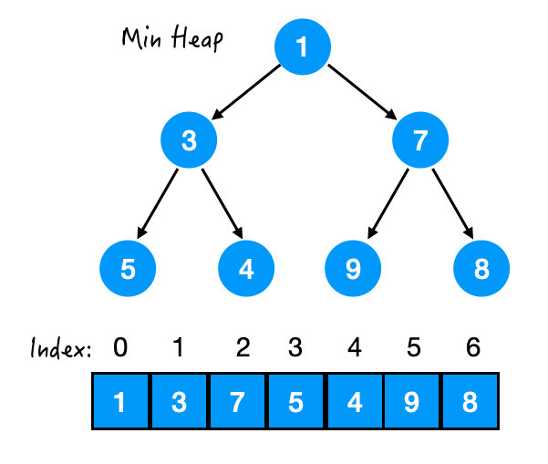

# 堆和优先队列

## 堆

### 定义

二叉堆（Heap）是一个可以被看成近似完全二叉树的**数组**。树上的每一个结点对应数组的一个元素。除了最底层外，该树是完全充满的，而且是从左到右填充。

>  逻辑结构是一颗完全二叉树，而实际物理结构是一个数组。

堆有堆序性(heap order): 任意节点都**优于**它的**所有孩子**。

- 最大堆：任意节点都**大于等于**它的所有孩子，这样的堆叫大顶堆。（堆顶为最大元素）
- 最小堆：任意节点都**小于等于**它的所有孩子，这样的堆叫大顶堆。（堆顶为最小元素）



既然堆是用数组来实现的，那么我们可以找到每个节点和它的父母/孩子之间的关系，从而可以直接访问到它们。

设当前节点的 index = x：（下标从0开始）

- 父结点 parent index = (x-1)/2
- 左孩子 left child index = 2*x + 1
- 右孩子 right child index = 2*x + 2.

### 应用

堆结构的一个常见应用是建立优先队列（Priority Queue）。在Java中也给出了优先队列的实现。

### 操作

- 插入元素（入队）
- 取出堆顶元素（出队）
- 删除元素
- 查找特定元素

## 优先队列

优先队列（Priority queue）也是一种队列，不过区别于传统队列的**先进先出**，优先队列的出队顺序是**按照优先级**来的。在插入一个元素之后，会根据定义的优先级把最大/最小的元素放在队列首部。

可以在O(1)时间内获得最大/最小值，可以在O(logn)时间内插入任意值。

Java中给出的`Priority queue`位于`java.util`包下，默认情况下对应的是**最小堆**。

### 基本变量

```java
//底层队列数组
transient Object[] queue;

private int size = 0;

//给出的比较器，默认是natural ordering，升序队列。
private final Comparator<? super E> comparator;
```

### 构造函数

```java
public PriorityQueue() {
    this(DEFAULT_INITIAL_CAPACITY, null);
}


public PriorityQueue(int initialCapacity) {
    this(initialCapacity, null);
}


//给出一个comparator实现自定义的优先级。
public PriorityQueue(Comparator<? super E> comparator) {
    this(DEFAULT_INITIAL_CAPACITY, comparator);
}


public PriorityQueue(int initialCapacity, Comparator<? super E> comparator) {
    if (initialCapacity < 1)
        throw new IllegalArgumentException();
    this.queue = new Object[initialCapacity];
    this.comparator = comparator;
}


//给出一个collection形参，将其构造为一个优先队列
public PriorityQueue(Collection<? extends E> c) {
    if (c instanceof SortedSet<?>) {
        SortedSet<? extends E> ss = (SortedSet<? extends E>) c;
        this.comparator = (Comparator<? super E>) ss.comparator();
        initElementsFromCollection(ss);
    }
    else if (c instanceof PriorityQueue<?>) {
        PriorityQueue<? extends E> pq = (PriorityQueue<? extends E>) c;
        this.comparator = (Comparator<? super E>) pq.comparator();
        initFromPriorityQueue(pq);
    }
    else {
        this.comparator = null;
        initFromCollection(c);
    }
}
```

### 堆化(heapify)

将一个无序的序列初始化成堆。

做法：把当前数组看作一个完全二叉树，从**最后一个非叶子结点**（ max_index/2 - 1）开始，自右向左自下向上，对每个结点执行`siftDown`操作。

> siftDown操作：
>
> 1. 该结点Node与其两个孩子结点中较小的一个比较，若大于孩子，则与孩子交换。
> 2. 交换后再与新的孩子比较并交换，直至没有孩子。
> 3. （一直不断往下迭代，所以是siftDown）

```java
private void heapify() {
    for (int i = (size >>> 1) - 1; i >= 0; i--)
    siftDown(i, (E) queue[i]);
}
```

- siftDown(Index i, Element e)

  ```java
//在k下标插入元素x，并不断将x向下迭代直至满足最小堆要求(x <= 其叶子节点)
  private void siftDown(int k, E x) {
      if (comparator != null)
          siftDownUsingComparator(k, x);
      else
          siftDownComparable(k, x);
  }
  
  
  private void siftDownUsingComparator(int k, E x) {
      //half：第一个叶节点
      int half = size >>> 1;
      //一直向下迭代到最后一个非叶节点
      //相当于判断结点有没有孩子节点(太优雅了)
      while (k < half) {
          //左孩子
          int child = (k << 1) + 1;
          Object c = queue[child];
          int right = child + 1;
          //c为左右孩子中小的那一个。
          if (right < size && comparator.compare((E) c, (E) queue[right]) > 0)
              c = queue[child = right];
          //x <= 其孩子结点，迭代结束
          if (comparator.compare(x, (E) c) <= 0)
              break;
          //否则swap(x, c)
          //k下标位置放置元素c
          queue[k] = c;
          //将迭代继续往下即 k 更新为较小孩子节点的下标
          k = child;
      }
      //最后将元素x放入k位置
      queue[k] = x;
  }
  ```
  

### 增

增/插入操作有**add(E e)**和**offer(E e)**，两个几乎无区别。只是插入失败时，前者抛异常，后者返回false。

```java
public boolean add(E e) {
    return offer(e);
}

public boolean offer(E e) {
    if (e == null)
        throw new NullPointerException();
    modCount++;
    int i = size;
    if (i >= queue.length)
        //Double size if small; else grow by 50%
        //int newCapacity = oldCapacity + ((oldCapacity < 64) ? (oldCapacity + 2) : (oldCapacity >> 1));
        grow(i + 1);
    size = i + 1;
    if (i == 0)
        //根节点直接插入
        queue[0] = e;
    else
        //否则siftUp
        siftUp(i, e);
    return true;
}
```

- siftUp(int index, E e)：在index处插入元素e，与父节点比较，如果小于父结点，则交换值，直至**没父结点**或**大于父结点**。

  ```java
  private void siftUp(int k, E x) {
      if (comparator != null)
          siftUpUsingComparator(k, x);
      else
          siftUpComparable(k, x);
  }
  
  private void siftUpUsingComparator(int k, E x) {
      //没有父结点即k<0停止迭代
      while (k > 0) {
          //父结点 parent index = (x-1)/2
          int parent = (k - 1) >>> 1;
          Object e = queue[parent];
          //最小堆：父结点<=任意子结点
          //则子结点大于父结点，停止迭代
          if (comparator.compare(x, (E) e) >= 0)
              break;
          //赋值父结点值给当前节点
          queue[k] = e;
        //往上迭代
          k = parent;
      }
      //在k处赋值x
      queue[k] = x;
  }
  ```
  

### 删

- poll()：移除队首元素

  > 把队首元素出队，把队尾元素放在队首然后siftDown。

  ```java
  public E poll() {
      if (size == 0)
          return null;
      //队尾元素下标
      int s = --size;
      modCount++;
      //队首元素
      E result = (E) queue[0];
      //队尾元素
      E x = (E) queue[s];
      //队尾置空
      queue[s] = null;
      //队尾元素不是队首的话，把队尾元素放在队首并siftDown
      if (s != 0)
          siftDown(0, x);
      return result;
  }
  ```

- remove(Object o)：移除指定元素

  > 同poll()操作，找到object的下标i后，移除i处元素，把队尾元素放在i处，然后siftDown

  ```java
  public boolean remove(Object o) {
      int i = indexOf(o);
      if (i == -1)
          return false;
      else {
          removeAt(i);
          return true;
      }
  }
  
  //移除index i处的元素
  private E removeAt(int i) {
      // assert i >= 0 && i < size;
      modCount++;
      int s = --size;
      //i为队尾元素，直接移除
      if (s == i) // removed last element
          queue[i] = null;
      else {
          //moved:队尾元素
          E moved = (E) queue[s];
          //队尾置空
          queue[s] = null;
          //把队尾放在i处，并siftDown
          siftDown(i, moved);
          //若队尾元素没有下沉，则需要在进行上浮操作
          if (queue[i] == moved) {
              siftUp(i, moved);
              if (queue[i] != moved)
                  return moved;
          }
      }
      return null;
  }
  ```

### 查

- peek()：获取但不删除队首元素  O(1)

  ```java
  public E peek() {
      return (size == 0) ? null : (E) queue[0];
  }
  ```

- indexOf(Object o)：返回某个元素的下标

  ```java
  private int indexOf(Object o) {
      if (o != null) {
          for (int i = 0; i < size; i++)
              if (o.equals(queue[i]))
                  return i;
      }
      return -1;
  }
  ```

## 参考文献

- [一分钟带你学懂——什么是堆？](https://zhuanlan.zhihu.com/p/262129810)
- [数据结构与算法(4)——优先队列和堆](https://www.cnblogs.com/wmyskxz/p/9301021.html)
- [堆](https://leetcode-cn.com/circle/articles/?tag=heap)

