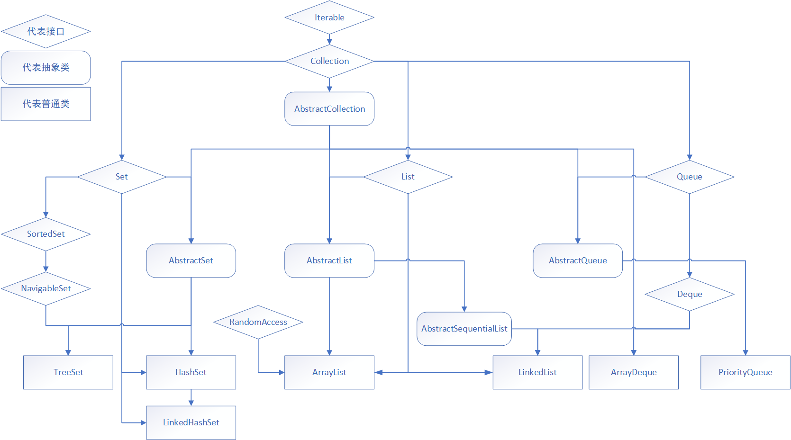
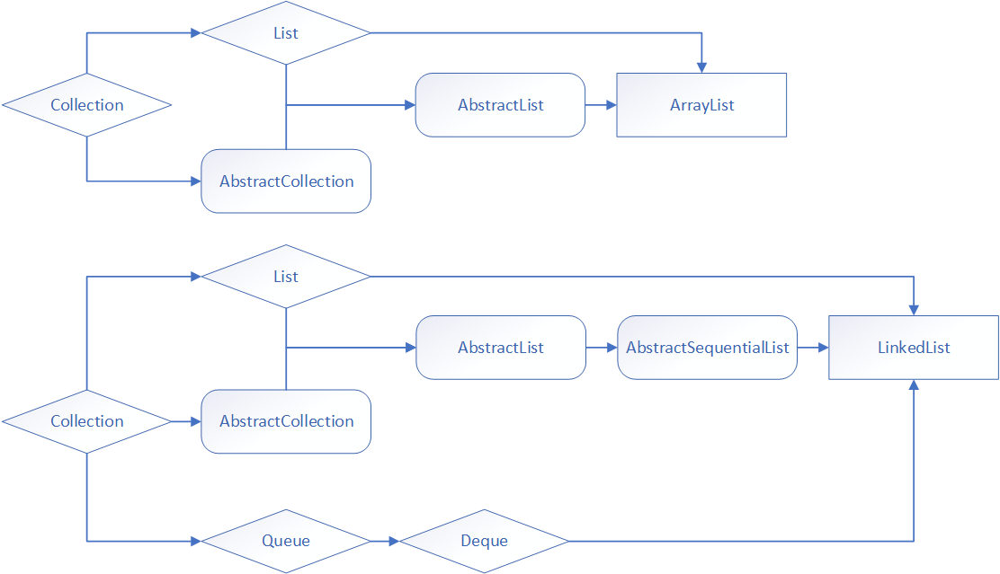
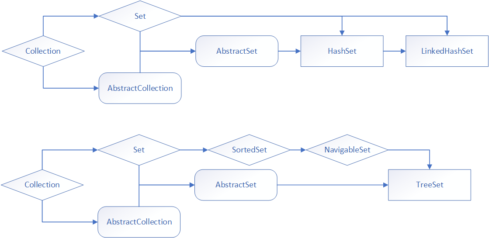
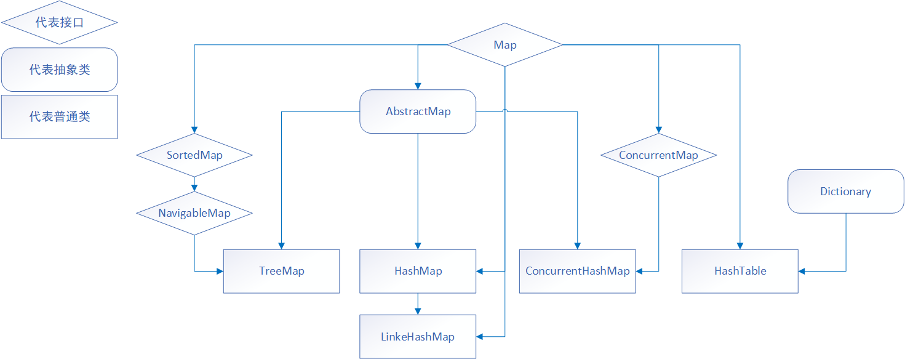

# Java集合框架总览
Java集合框架分为两大接口，**Collection**接口和**Map**接口。

- **Collection**接口：存放单一元素
- **Map**接口：存放键值对(key-value)

# Collection总览
先上图，本图根据JDK1.8绘制。

根据整个结构图，可以看出整体的设计思路基本是：

- Collection接口  **+**  对应的三大接口之一  **→**  abstract类  **→**  具体类。

- 接口规定了最基本的操作，而抽象类则是针对其具体实现类规定了更加定制/具体的操作。（抽象类 = collection接口 + 三大接口之一）

## List总览
**List**：序列，最大的特点是**有序**（*按插入顺序进行存储*），**可重复**。

1. An **ordered** collection (also known as a sequence)
2. Unlike sets, lists typically allow **duplicate** elements.

List基本分为`ArrayList`和`LinkedList`，两者的区别在于底层实现一个是数组一个是双链表，关于两者的对比会在下一篇List详解中给出。

## Set总览
**Set**：集合，**无序** +  **不可重复**。
就跟我们之前学过的集合概念一样，最多只能有一个null值。
**Set**分为`HashSet`, `LinkedHashSet`和 `TreeSet`。详解将在之后的章节给出。

# Map总览
Map是一个键值对（key-value pair），其中key之间不可重复，每个key至多映射到一个值。
1. A map **cannot contain duplicate** keys
2. each key can map to **at most** one value

基本的实现有`HashMap`, `LinkedHashMap`和`TreeMap`，（与set的实现类相对应）以及为了并发操作而创建的`ConcurrentHashMap`。
