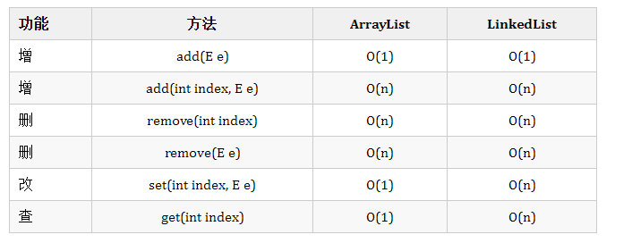

# List详解

## ArrayList

ArrayList底层数据结构为**object数组**。

 **1. 基本变量：**

```java
    /**
    * Default initial capacity.
    */
    private static final int DEFAULT_CAPACITY = 10;

    /**
     * Shared empty array instance used for empty instances.
     */
    private static final Object[] EMPTY_ELEMENTDATA = {};

    /**
     * Shared empty array instance used for default sized empty instances. We
     * distinguish this from EMPTY_ELEMENTDATA to know how much to inflate when
     * first element is added.
     */
    private static final Object[] DEFAULTCAPACITY_EMPTY_ELEMENTDATA = {};

    /**
     * The array buffer into which the elements of the ArrayList are stored.
     * The capacity of the ArrayList is the length of this array buffer. Any
     * empty ArrayList with elementData == DEFAULTCAPACITY_EMPTY_ELEMENTDATA
     * will be expanded to DEFAULT_CAPACITY when the first element is added.
     */
    transient Object[] elementData; // non-private to simplify nested class access

    /**
     * The size of the ArrayList (the number of elements it contains).
     *
     * @serial
     */
    private int size;
```

 - 其中`elementData`数组为其底层数据结构。
 - `size`：当前数组中元素的个数。
 - `Capacity`：数组为了完成对应操作所需要的容量大小。比如进行一个add(E e)操作，那么数组为了完成这个增操作所需要的最小Capacity = size + 1。
 - `EMPTY_ELEMENTDATA` 与`DEFAULTCAPACITY_EMPTY_ELEMENTDATA` 的区别在于：
 	- **初始化ArrayList时不指定初始容量**，那么其`elementdata` = `DEFAULTCAPACITY_EMPTY_ELEMENTDATA`，并且在后面第一次扩容时直接扩容为**DEFAULT_CAPACITY(10)长度**的数组。
 	- **初始化ArrayList时指定初始容量=0**，那么其`elementdata` = `EMPTY_ELEMENTDATA`，扩容时按照正常扩容策略进行扩容。
 	- `DEFAULTCAPACITY_EMPTY_ELEMENTDATA` 的引入是一个有趣的设计，在大多数情景下，大家初始化时都不指定初始容量，为了避免多次扩容，所以直接首次扩容到长度为10的数组，从而能够避免多次扩容的操作。
```java
    /**
    * Constructs an empty list with the specified initial capacity.
    *
    * @param  initialCapacity  the initial capacity of the list
    * @throws IllegalArgumentException if the specified initial capacity is negative
    */
    public ArrayList(int initialCapacity) {
        if (initialCapacity > 0) {
            this.elementData = new Object[initialCapacity];
        } else if (initialCapacity == 0) {
            this.elementData = EMPTY_ELEMENTDATA;
        } else {
            throw new IllegalArgumentException("Illegal Capacity: "+ initialCapacity);
        }
    }
    /**
    * Constructs an empty list with an initial capacity of ten.
    */
    public ArrayList() {
        this.elementData = DEFAULTCAPACITY_EMPTY_ELEMENTDATA;
    }
    	
    private void ensureCapacityInternal(int minCapacity) {
        if (elementData == DEFAULTCAPACITY_EMPTY_ELEMENTDATA) {
            minCapacity = Math.max(DEFAULT_CAPACITY, minCapacity);
        }

        ensureExplicitCapacity(minCapacity);
    }
```
**2. 扩容策略。**

 - `ensureCapacityInternal`函数：针对`DEFAULTCAPACITY_EMPTY_ELEMENTDATA `将其扩容为容量为10。
```java
    public boolean add(E e) {
        ensureCapacityInternal(size + 1);  // Increments modCount!!
        elementData[size++] = e;
        return true;
    }
    
    private void ensureCapacityInternal(int minCapacity) {
        if (elementData == DEFAULTCAPACITY_EMPTY_ELEMENTDATA) {
            minCapacity = Math.max(DEFAULT_CAPACITY, minCapacity);
        }

        ensureExplicitCapacity(minCapacity);
    }
```
- `ensureExplicitCapacity`函数：修改`modcount`，并判断是否需要扩容，若需要扩容则调用`grow`函数。
```java
    private void ensureExplicitCapacity(int minCapacity) {
        modCount++;

        // overflow-conscious code
        if (minCapacity - elementData.length > 0)
            grow(minCapacity);
    }
```
- `grow`函数：扩容的核心函数。
	- 其基本策略为扩容为原数组lenght的1.5倍(向下取整)，`newCapacity = oldCapacity + (oldCapacity >> 1)`。
	- 得到的`newCapacity`与`minCapacity`比较取大值。
	- 当`newCapacity`大于规定的`MAX_ARRAY_SIZE`(Integer的最大值-8)时，判断`minCapacity`是否大于`MAX_ARRAY_SIZE`，如果大于则取`Integer.MAX_VALUE`，否则取`MAX_ARRAY_SIZE`。
```java
    /**
    * Increases the capacity to ensure that it can hold at least the
    * number of elements specified by the minimum capacity argument.
    *
    * @param minCapacity the desired minimum capacity
    */
    private void grow(int minCapacity) {
        // overflow-conscious code
        int oldCapacity = elementData.length;
        int newCapacity = oldCapacity + (oldCapacity >> 1);
        if (newCapacity - minCapacity < 0)
            newCapacity = minCapacity;
        if (newCapacity - MAX_ARRAY_SIZE > 0)
            newCapacity = hugeCapacity(minCapacity);
        // minCapacity is usually close to size, so this is a win:
        elementData = Arrays.copyOf(elementData, newCapacity);
    }

    private static int hugeCapacity(int minCapacity) {
        if (minCapacity < 0) // overflow
            throw new OutOfMemoryError();
        return (minCapacity > MAX_ARRAY_SIZE) ? Integer.MAX_VALUE : MAX_ARRAY_SIZE;
    }
```
**3. 增**

- `add(E e)`：**O(1)**
- `add(int index, E e)`：**O(n)**.
主要耗时在将index位置及之后的元素向后移动一位。O(n-index)
`System.arraycopy(Object src, int srcPos, Object dest, int destPos, int length)`：将`src`数组从`srcPos`下标开始长度为`length`的子数组移动到数组`dest`,开始下标为`destPos`。

**4. 删**

- `remove(int index)`：**O(n)**.
找到这个index元素为O(1)，移除之后调用`System.arraycopy()`函数来完成数组的改变为O(n)。
- `remove(Object o)`：**O(n)**
寻找这个元素为O(n)，找到之后再调用`System.arraycopy()`也为O(n)，总的也为O(n)。

**5.改**

- `set(int index, E element)`：**O(1)**.

**6. 查**

- `get(int index)`：**O(1)**.
## LinkedList

LinkedList底层数据结构是一个**双向链表**。

**1. 基本变量**

```java
    transient int size = 0;

    /**
    * Pointer to first node.
    * Invariant: (first == null && last == null) ||
    *            (first.prev == null && first.item != null)
    */
    transient Node<E> first;

    /**
    * Pointer to last node.
    * Invariant: (first == null && last == null) ||
    *            (last.next == null && last.item != null)
    */
    transient Node<E> last;

    private static class Node<E> {
        E item;
        Node<E> next;
        Node<E> prev;

        Node(Node<E> prev, E element, Node<E> next) {
            this.item = element;
            this.next = next;
            this.prev = prev;
        }
    }

```
- 此处设置了只要不是空表(`first == null && last == null`)那么 `first.prev = null`和`last.next = null`从而保证了这是一个双链表而不是双向循环链表。 

**2. 增**

- `add(E e)`：将元素e加到链表尾部。**O(1)**
	
	- e.prev = last (e的prev指针指向原链表最后一个节点)
	- e.next = null (e作为新链表最后一个节点，其next=null)
	- 将newnode设置为新链表的last结点
	- 如果原链表为空（`l=null`），那么e同时也是first节点
	- 如果原链表不为空，那么原链表的最后一个节点.next = e。
	```java
  	public boolean add(E e) {
        	linkLast(e);
        	return true;
  	}
	
    /**
    * Links e as last element.
    */
    void linkLast(E e) {
        final Node<E> l = last;
        final Node<E> newNode = new Node<>(l, e, null);
        last = newNode;
        if (l == null)
            first = newNode;
        else
            l.next = newNode;
        size++;
        modCount++;
    }
	```
	
- `add(int index, E e)`：将元素e增加到指定位置。**O(n)**
	
	- index == size, e增加到表尾
	```java
    public void add(int index, E element) {
        checkPositionIndex(index);
  
        if (index == size)
            linkLast(element);
        else
            linkBefore(element, node(index));
    }
	```
	-  将元素e增加到index位置的元素之前。
		- 先找到index位置的node(`succ`)，使用折半查找，**O(n/2)**
		- 插入元素newnode.
			- newnode.prev = succ.prev(pred)
			- newnode.next = succ
			- succ.prev = newnode
			- pred.next = newnode
	```java
    /**
    * Returns the (non-null) Node at the specified element index.
    */
    Node<E> node(int index) {
        // assert isElementIndex(index);
  
        if (index < (size >> 1)) {
            Node<E> x = first;
            for (int i = 0; i < index; i++)
                x = x.next;
            return x;
        } else {
            Node<E> x = last;
            for (int i = size - 1; i > index; i--)
                x = x.prev;
            return x;
        }
    }
    /**
    * Inserts element e before non-null Node succ.
    */
    void linkBefore(E e, Node<E> succ) {
        // assert succ != null;
        final Node<E> pred = succ.prev;
        final Node<E> newNode = new Node<>(pred, e, succ);
        succ.prev = newNode;
        if (pred == null)
            first = newNode;
        else
            pred.next = newNode;
        size++;
        modCount++;
    }
	```

**3. 删**

- `remove(E e)`：找到并移除这个元素（第一次出现）。**O(n)**

- `remove(int index)`：移除index位置的元素。**O(n)**
	
	```java
    public boolean remove(Object o) {
        if (o == null) {
            for (Node<E> x = first; x != null; x = x.next) {
                if (x.item == null) {
                    unlink(x);
                    return true;
                }
            }
        } else {
            for (Node<E> x = first; x != null; x = x.next) {
                if (o.equals(x.item)) {
                    unlink(x);
                    return true;
                }
            }
        }
        return false;
    }
		
    public E remove(int index) {
        checkElementIndex(index);
        return unlink(node(index));
    }
	```


- 移除操作详解：
	-  prev == null(x为队首)，移除x以后，next为队首。
	- prev != null，next.prev = prev，置x.prev为空
	- next == null(x为队尾)，prev为队尾
	- next != null，prev.next = next，置x.next为空
	- 如果不考虑prev和next为空的情况，由于已经将x.next和x.prev存储下来了，那么应该是prev.next = next, next.prev = prev,再加上置空操作。再加上考虑到prev和next为空的情况，这就是整个代码的思路。
	```java
    /**
    * Unlinks non-null node x.
    */
    E unlink(Node<E> x) {
        // assert x != null;
        final E element = x.item;
        final Node<E> next = x.next;
        final Node<E> prev = x.prev;

        if (prev == null) {
            first = next;
        } else {
            prev.next = next;
            x.prev = null;
        }

        if (next == null) {
            last = prev;
        } else {
            next.prev = prev;
            x.next = null;
        }

        x.item = null;
        size--;
        modCount++;
        return element;
    }
  ```

**4. 改**

- `set(int index, E e)`：**O(n)**
	先找到对应index的元素，通过`node(int index)`查找，之后设置其item = e，这个函数在上面有提到过，**O(n/2)**。

**5. 查**

- `get(int index)`：**O(n)**
  通过`node(int index)`查找，**O(n/2)**。

## 两者对比

**1. 基本操作的复杂度对比**

**2. 总结**

- ArrayList由于下标的存在，是可以随机访问的，只要给定一个index可以直接取到对应的元素，因此其get()和set()方法为O(1)，而对应的LinkedList这两个操作则为O(n)。
- 在**增**操作中(删操作同理)
	- `add(E e)`是在尾部加元素，ArrayList虽然会出现扩容的情况，但均摊复杂度还是O(1)；而LinkedList由于双链表last指针的存在，也是O(1)。
	- `add(int index, E e)`是在指定位置加元素。这个操作涉及两部分，**首先**是找到这个位置的元素，ArrayList为O(1)，LinkedList为**O(|N/2 - index|)**(参考`node(int index)`函数)；**其后**ArrayList需要移动O(N-index)个位置，LinkedList则完成指针的对应操作即可O(1)。因此，该操作LinkedList较好。
- 大部分情况下**改查多用ArrayList**，**增删多用LinkedList**。