# 红黑树详解
## 定义
红黑树是一种**自平衡二叉查找树**，是一种特殊的平衡二叉树，在进行插入和删除操作时会通过特定操作来保持二叉查找树的平衡，从而获取良好的查找性能。相比于**链表**只能循环遍历去找寻某个特定节点**o(n)**，其能在`o(log n)`内做查找，也因此被用在了HashMap中。

**性质：**

> 1. 每个节点都带有颜色属性，只能为黑色或红色。
>
> 2. **根节点**是黑色
>
> 3. 所有**叶子节点**(NIL)是黑色
>
> 4. 每个红色节点的两个**子节点都是黑色**(每个叶子到根的所有路径上不能有两个连续的红色节点)
>
> 5. 从任一节点到其每个叶子结点(NIL结点)的**所有路径**都包含**相同数目的黑色节点**。
>
>    ​        5.1  从5推出：如果一个结点存在黑色子节点，那么该结点肯定有两个子节点。
>

这些性质保证了红黑树最关键的性质：**从根到叶子的最长路径不多于最短路径的两倍**，所以称为**平衡**。性质4与5保证了这一关键性质。最短路径上都是黑色结点，最长路径为红黑节点交替，性质5保证了最长路径中包含的黑色节点数组等于最短路径的黑色节点，而加之性质4保证了最长路径上红色结点的数目不多于黑色节点的数目，所以**从根到叶子的最长路径不多于最短路径的两倍**，所以红黑树的高度小于等于2*log(n+1)。
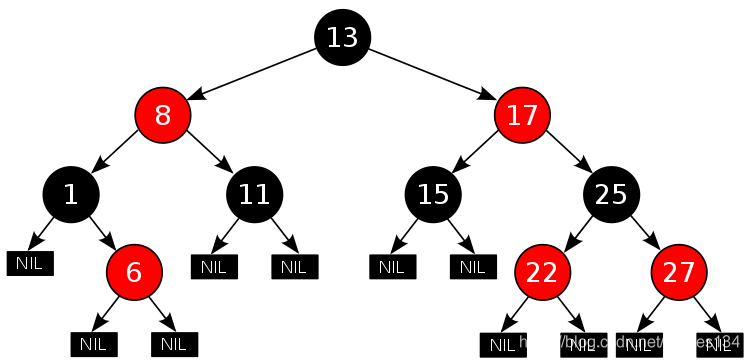

- NIL结点/叶子节点

  需要注意的是在红黑树中`NIL`结点代表了**NULL**结点，在实际的编程过程中其实并不需要去创建这些节点，直接用`child poiniter = null`即可。在绘图时可以加上这些**空的黑叶子节点**用于对照满足红黑树的性质。
### 比较与总结
- **二叉树**

  每个结点最多只能有两棵子树

- **二叉查找树/二叉排序树**

  - 若左子树不空，则左子树上所有结点的值均小于它的根结点的值；

  - 若右子树不空，则右子树上所有结点的值均大于它的根结点的值；

  - 左、右子树也分别为二叉排序树；

  - 没有键值相等的结点。

    总结：左 < 根 < 右

- **平衡树**

  任意节点的子树的高度差都小于等于1

- **AVL树（二叉平衡搜索树）**

  在二叉搜索树的基础上多了一个左右子树高度差小于1的限制条件，所以在插入/删除节点后不满足条件的话，需要根据不再平衡的原因进行调整。

- **红黑树**

  红黑树可以认为是一种特殊的AVL树，特殊在：

  1. 其每个结点有颜色属性
  2. 左右子树的高度差有可能大于1。
## 操作
### 获取/查找
步骤：
1. 若根节点的关键值等于查找的关键值，则成功
2. 若小于，递归查找左子树
3. 若大于，递归查找右子树。
4. 若子树为空，查找不成功。

伪代码实现：
```cpp
递归式:
Tree-Search (x, k)
if x == NULL or k ==x.key
    return x
if k < x.key
    return Tree-Search(x.left, k)
else return Tree-Search(x.right, k)

非递归式:
Iterative-Tree-Search(x, k)
while x != NULL and k != x.key
    if k < x.key
        x = x.left
    else x = x.right
return x
```
### 插入
插入步骤分为两步：
1. 寻找位置并插入(与普通二叉查找树的插入操作一样)，设插入节点为红色
2. 调整(包括左旋、右旋、变色调整)。
```cpp
插入操作
RB_INSERT(Tree T, Node z) 
y = T.nil //y为后续的插入结点z的父节点，先置为空, NIL代表为红黑树为空的结点
x = T.root //x为后续的插入节点的z的位置，先置为根节点

//寻找插入节点的位置，步骤类似寻找操作
//不断地循环遍历直至 x为空。此时y为一个真实结点，为x的父节点
//最后的插入位置x一定是一个T.nil结点，而此时的y为x的父节点
while x != T.nil
    y = x
    if z.key < x.key
        x = x.left
    else x = x.right	
//设置插入节点的父节点为y
z.parent = y
//设置父节点y的子节点为插入节点
if y == T.nil
    T.root = z
else if z.key < y.key
    y.left = z
else y.right = z
//设置插入节点z的子节点为nil
z.left = T.nil
z.right = T.nil
z.color = RED
//进行插入后的调整
RB_INSERT_FIXUP(T, z)		
```
此时我们已经完成了插入操作，并将插入结点设为了红色，但这样做可能会导致不再满足红黑树的性质，因此我们需要进行相应的调整操作(左旋、右旋和着色)。在介绍如何进行调整之前我们先介绍一下基础操作：左旋，右旋。
- **左旋**

  以某个结点**X**作为支点(旋转结点)，其右子结点**Y**变为旋转结点**X**的父结点，右子结点**Y**的左子结点**β**变为旋转结点**X**的右子结点，右子结点**γ**保持不变。

  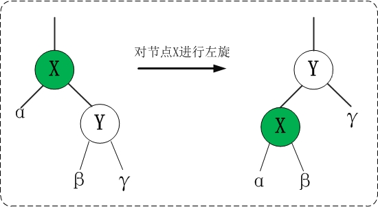

  ```cpp
  //左旋操作
  LEFT_ROTATE(Tree T, Node x)
  // 获取旋转结点x的右孩子y
  y = x.rChild 		
  
  //1. 操作y的左孩子β
  x.rChild = y.lChild	//1.1 设β为x的右孩子
  y.lChild.parent = x	//1.2 设β的父节点为x
  
  //2. 将y上移
  y.parent = x.parent	
  //2.1 设y的父节点
  if x.parent == T.NIL
      T.root = y                   
  //2.2 设x的父节点的孩子节点为y
  else if x.parent.lChild == x     
      x.parent.lChild = y
  else x.parent.rChild = y
  
  //3. 将x下移
  y.lChild = x
  x.parent = y
  ```

- **右旋**

  以某个结点**Y**作为支点(旋转结点)，其左子结点**X**变为旋转结点**Y**的父结点，左子结点**X**的右子结点**β**变为旋转结点**Y**的左子结点，左子结点**α**保持不变。
  
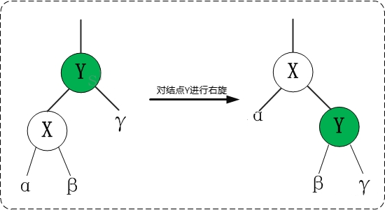
  
  ```cpp
  //右旋操作
  RIGHT_ROTATE(Tree T, Node y)
  //获取y的左子节点x
  x = y.lChild
  
  //1. 操作x的右子节点β
  y.lChild = x.rChild
  x.rChild.parent = y
  
  // 2.将x上移
  x.parent = y.parent
  if y.parent == T.NIL
      T.root = x
  else if y.parent.lChild == y
      y.parent.lchild = x		
  else y.parent.rChild = x
  
  //3.将y下移
  x.rChild = y
  y.parent = x
  ```

上面我们讲了插入一个结点**z**并置其颜色为红色，当且**仅当其父节点为红色**时会违反**性质2与4**。那么根据不同的情况我们需要分开讨论，在这里我们仅用**插入节点的父节点为祖父节点的左子树**做说明。

`FIX_UP`函数总体思路：父节点为红色，则祖父节点一定为**黑色**，那么就根据叔父结点来进行不同的操作。通过循环来不断地将冲突结点往上走，只要当前结点的父节点仍然为红则不断迭代。根据父节点为左子树还是右子树分成两个category，每个category再分为三个case，本文用父节点为左子树示例，另一个category为左右颠倒即可。

- **case 1**： 叔父结点为红，父节点、叔父结点置黑，祖父节点置红，把当前结点上移置祖父节点。
  
  叔父结点为红，则父节点和祖父节点**置反**，再**上移**。

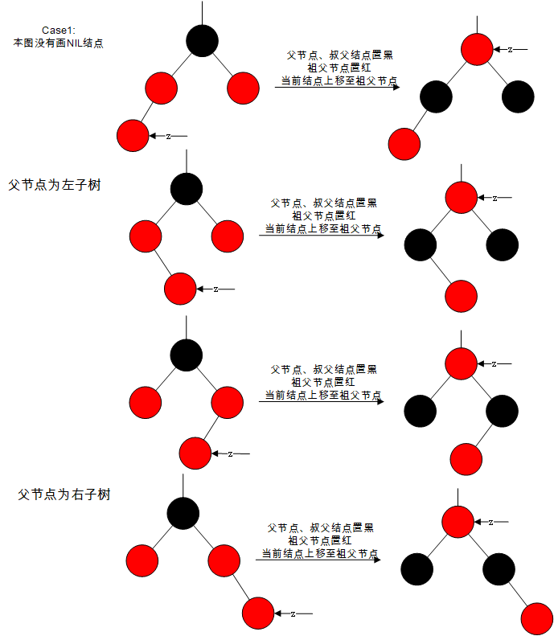

- **case 2**: 叔父结点为黑(NIL)，当前结点z为右子树，单纯的取反会破坏黑平衡，此时选择**先旋转**，保证两边子树**高度一样后在着色**从而实现黑平衡。此时z为**右子树**，所以将z**上移**至父节点，以z为结点**左旋**。

  > 叔父结点为黑的情况下，叔父结点基本为NIL，因为祖父节点的左子树的黑高为1，那么相应的右子树的黑高也为1，所以叔父结点只能是NIL。
  > 特殊情况：结点z通过case1上升到祖父节点，此时z的叔父结点可能为非NIL结点。

	上移至父节点，z左旋。
	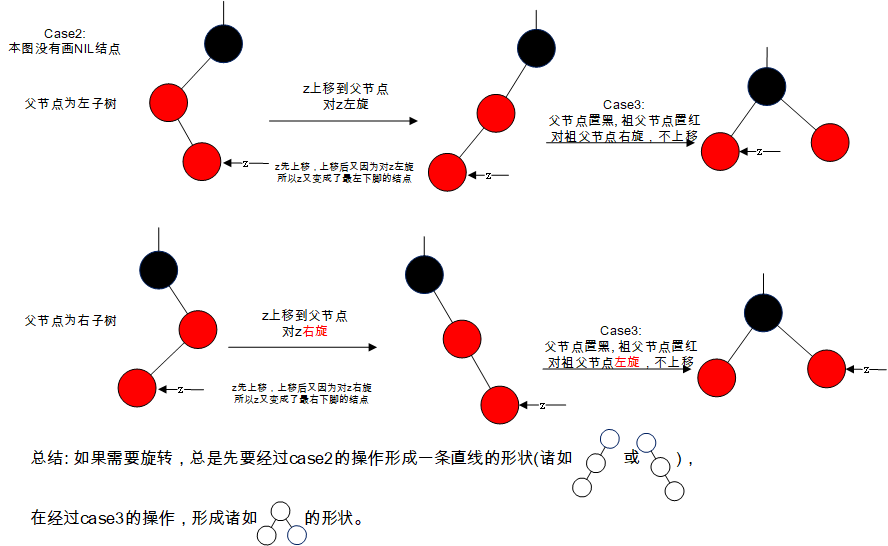

- **case 3**: 叔父结点为黑(NIL)，当前结点为**左子树**，此时也是一样需要进行旋转操作，具体做法为父节点置黑，祖父节点置红，以祖父节点右旋，不上移。

  父+祖父取反，祖父右旋。

  

  | 情况列表 | 情况说明                        | 解决方法                                                     |
  | -------- | ------------------------------- | ------------------------------------------------------------ |
  | case1    | 叔父结点为红                    | 父结点，叔父结点置黑，祖父节点置红(三个置反)                 |
  | case2    | 叔父结点为黑，当前结点z为右子树 | 上移至父节点，左移                                           |
  | case3    | 叔父结点为黑，当前结点z为左子树 | 父节点置黑，祖父结点置红，以祖父结点为支点右旋(右旋 + 两个置反) |

**总结**：红黑树的灵魂在于**利用颜色标识来实现树的黑高度平衡**，区别于AVL树的**左右子树高度平衡(不大于1)**，他实现的是**黑高度平衡**(性质5: 每条路的黑色节点个数相等)，那么在插入操作时自然选择设置插入结点z为红色，这样最能保持黑高度平衡。z的父节点为黑，则不需要进行任何操作；当z的父节点为红色时，不满足性质4(*不能有两个连续的红色结点*)，此时有两个解决策略：

1. 颜色取反(对应case1)。
2. 旋转+颜色取反。

- 单纯的颜色取反对于某些情况适用(case1即叔父结点为红)，此时祖父节点的黑高度为0(不算NIL结点)，单纯的颜色取反后实现从祖父节点到z为**红黑红**，此时叔父结点也需要增加一个黑色结点，则叔父结点也置反，完成操作。所以当叔父结点为红时，三个结点颜色取反即可。
- 当叔父结点为黑/NIL结点时，单纯的取反已经不能满足了(会破坏黑平衡)，那么此时通过**旋转的方式来增加未插入结点的子树高度**，**再通过颜色取反来实现黑平衡**。比如case2在**右边**插入，则**父节点左旋**；case3在**左边**插入，则**祖父节点右旋** + **父 祖父颜色置反**。


**伪代码：**
```cpp
调整操作
RB_INSERT_FIXUP(Tree T, Node z)
//只要z的父节点为红色则不断迭代
while z.parent.color == RED
    //z的父节点为左子树
    //仅以这个情况举例，若父节点为右子树则左右颠倒
    if z.parent == z.parent.parent.left
        // y为叔父结点
        y = z.parent.parent.right
        //case1:叔父结点为红
        //操作：三个置反 + 上移至祖父节点
        if y.color = RED
            z.parent.color = BLACK
            y.color = BLACK
            z.parent.parent.color = RED
            z = z.parent.parent
        //case2:叔父结点为黑 AND z为右子树(从右边插入)
        // z上移至父节点 + 以z左旋
        else if z = z.parent.right
            z = z.parent
            LEFT_ROTATE(T, z)
        //case 3: 叔父结点为黑 AND z为左子树(从左边插入)
        // 父祖父置反 + 以z的祖父右旋
        else
            z.parent.color = BALCK
            z.parent.parent.color = RED
            RIGHT_ROTATE(T, z.parent.parent)
    //z的父结点为右子树
    else
        ...
 
//置根节点颜色为黑
T.root.color = BLACK	
```
### 删除
删除操作相比插入操作更加复杂，但抽象来概括也是分为两部：
1. 寻找结点并且删除(与普通二叉查找树相似)
2. 调整

在介绍删除操作前，我们先讲解一些后续需要用到的专业名词。
- 前继结点：进行**中序遍历**(左中右)时当前结点的**前**一个结点。
- 后继结点：进行**中序遍历**(左中右)时当前结点的**后**一个节点。

下面介绍**删除**操作的基本思想，首先最重要的就是删除**被删结点z**之后仍然能**保持**二叉查找树的**有序性**，那么根据结点z**有无子节点**分为三种情况。
- case1: z没有子节点(不考虑NIL结点)，直接删除z即可。

- case2: z仅有一个子节点，用z的子节点y顶替z的位置，然后删除z结点。

- case3: z有两个子节点，在这种情况下我们需要找出最接近z的结点来代替z：**z的左子树u的最右结点**(前继结点)或**z的右子树v的最左结点**(后继结点)，这两种方法都行，在这里我们用**后继结点y**来进行操作。根据定义可知，后继结点要么**没有孩子结点**要么**有且仅有右子结点**(后继结点为右子树最左结点，不存在一个结点比后继结点还小)。 

  基本思想：**用z的后继结点y来代替z**，删除z；用y的右子节点x(如果有)顶替y，删除y，如果y没有右子节点则直接删除y。

  需要特别注意的是，需要根据**y是否是z的右孩子**进行分类，否则会出现循环指针问题(后面伪代码中会解释)

  - case3.1：y是z的右孩子，直接把**以y为根的子树移植到以z为根的子树上**(y代替z)，再设置z的左孩子为y的左孩子。
  - case3.2: y不是z的右孩子，把**以x为根的子树移植到以y为根的子树上**(x代替y)，y结点上移置z的右孩子结点位置，把**以y为根的子树移植到以z为根的子树上**(y代替z)，再设置z的左孩子为y的左孩子。
  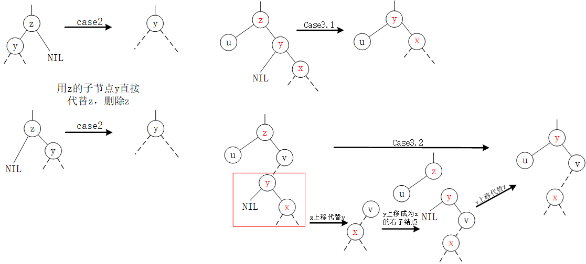

在进行删除操作的伪代码编写前，我们先抽象出来一个函数`TRANSPLANT(T, u, v)`用于把**以v为根的子树**移植到**以u为根的子树**上。

1. v成为u的父节点的孩子结点；

2. v的父节点为u的父节点。

```cpp
//移植操作：本质是完成u与v的父结点的链接
RB_TRANSPLANT(Tree T, Node u, Node v)
//1. v成为u的父节点的孩子节点
if u.parent = T.nil
    T.root = v
else if u == u.parent.lChild
    u.parent.lChild = v
else u.parent.rChild = v
//2. 完成v的父节点的赋值
v.parent = u.parent
```
下面我们进行删除操作`RB_DELETE()`的伪代码编写。
```cpp
//删除操作
RB_DELETE(Tree T, Node z)
//y代表z的后继结点，初始赋值为z
y = z	
//后继结点的初始颜色，如果为黑则需要进行FIXUP
y-original-color = y.color

//case2: z仅有右子节点的情况
if z.lChild == T.nil
    //x为后继结点y的代替节点，此刻y为z,x为z的右子结点
    x = z.rChild
    //把z的右孩子上移代替z
    RB_TRANSPARENT(T, z, z.rChild)
//case2: z仅有左子节点的情况
else if z.rChild == T.nil
    x = z.lChild
    //把z的左孩子上移代替z
    RB_TRANSPARENT(T, z, z.lChild)

//case3:z有两个子节点的情况下
//寻找z的右子树的最小结点即z的后继结点
else y = TREE_MINIMUM(z.right)
    //y改变，y-original-color随之重新赋值
    y-original-color = y.color
    //x为y的右子结点(可能为T.nil)
    x = y.rChild
    //case3.2: y不是z的右子结点，先行成以y为根的右子树(y上移+x上移),再把z的右子结点y上移代替z
	if y.parent != z
        //x上移至y原来的位置
        RB_TRANSPARENT(T, y, y.rChild)
        //y上移至z的右子结点位置
        y.rChild = z.rChild
        y.rChild.parent = y
    //case3.1: y是z的右子结点，用z的右子结点y上移代替z
    RB_TRANSPLANT(T, z, y)
    //完成y跟z的左子结点的链接
    y.lChild= z.lChild
    y.lChild.parent = y
    //y移置z的位置，那么相应的y的颜色也需要改成原来z的颜色
    y.color = z.color

if y-original-color = BLACK
    RB_DELETE_FIXUP(T, x)	
```
相似于插入操作，对红黑树进行元素的删除后也要考虑保持红黑树的性质。
- **y-original-color为红**，那么不需要进行调整。
	- **红黑树的黑高没变**。即使y和x上移，y上移代替z后置颜色为原z的颜色，x上移后颜色不变，整个过程黑色结点的数量没变，只是少了一个红色结点。
	-  	**不存在两个相邻的红结点**。y上移代替z并且置颜色为原z的颜色，颜色分布没有变；x上移代替y，y为红，则x为黑，因此x上移不会使两个红结点相邻。
	- y是红，则y一定不是根节点，删除操作后根节点颜色仍为黑。
- **y-original-color为黑**，则需要进行相应的调整。

在我们进行`FIXUP()`函数的分析前，我们先来温习一下红黑树的五个性质。
> 1. 每个节点都带有颜色属性，只能为黑色或红色。
>
> 2. **根节点**是黑色
>
> 3. 所有**叶子节点**(NIL)是黑色
>
> 4. 每个`红色节点`的两个**子节点都是黑色**(每个叶子到根的所有路径上不能有两个连续的红色节点)
>
> 5. 从任一节点到其每个叶子结点(NIL结点)的**所有路径**都包含**相同数目的黑色节点**。
>
>    ​        5.1  从5推出：如果一个结点存在黑色子节点，那么该结点肯定有两个子节点。
>

当**y-original-color为黑**，通过`RB_DELETE`函数，我们知道删除了y结点后，x占据了y原来的结点，整个路径上**少了一个黑色结点**，那么很简单我们**把这个黑色加在x结点上**(x的color属性仍然为它自身本身的属性，只是它额外多了一个黑色)，这样就能保证黑高在操作前后没有变动。

现在，x不仅包含它原来的颜色属性，还多出来了一个额外的黑色，即x为“黑黑”/“红黑”，这样违反了性质1。现在我们要做的就是消去这多余的颜色属性，使得x的颜色属性只包含一个。

根本思想：将x所包含的额外黑色不断上移，直到：

1. x为**红黑**节点，此时将x着色为**单个黑色**。
2. x为**根节点**，此时直接**移除**额外的黑色。
3. x为**黑+黑**结点且非根节点，根据不同case执行对应的着色和旋转。

下面我们来详细描述一下**上述情况3中**不同的case如何操作，在这里我们以x为父节点的**左孩子**作为示例进行讲解，我们定义**x的兄弟结点为w**(由于x为双重黑色结点，所以w一定为非叶子结点，否则违反性质5)。
> 注：x基本上是双重黑色的NIL结点。因为x是后继结点y的右孩子结点，根据性质可以知道如果x是黑色的非NIL结点，那么y必定有左孩子结点，与后继结点(右子树的最左结点)定义冲突，所以可以得知x基本上是双重黑色的NIL结点。
>
> 特殊情况：x属于case2的情况下上移后不一定是双重黑色的NIL结点。
- **case1**: w为红，那么此刻w/x的父节点和w的孩子节点必定为黑色。
	
	操作：w着黑，x的父节点着红，以x的父节点进行左旋，左旋后重新设置x的兄弟结点。
	
	思想：这样做是为了将“case1”转换为”case2”，“case3”或“case4"，即将w变换为黑色的，从而进行进一步的处理。为了让w变黑，一定要进行左旋(单纯的置黑会破坏黑高)而因为进行了左旋，为了保持黑高，父节点置红，w置黑。

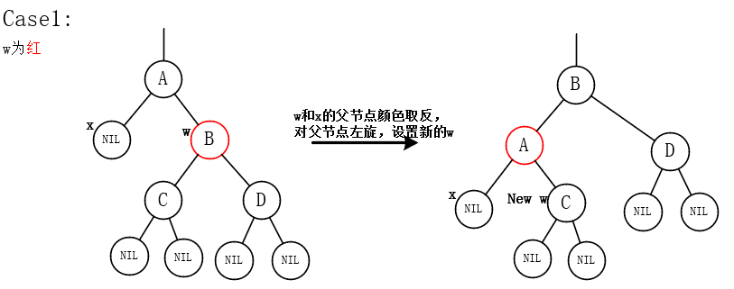
	
- **case2**：w为黑，且w的**两个孩子都为黑**。

  操作：w置红，设置x的父结点为新的x结点。

  思想：主要思想是“**将X多余的一层黑色向上移**”，那么此时为了保持黑高，需要在右子树去除一个黑结点，所以w置红。

  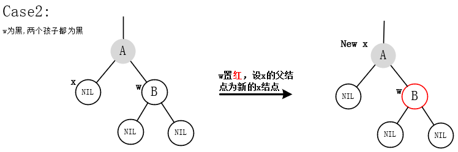

- **case3**: w为黑，且w的**右孩子为黑**，左孩子为红。
	
	操作：w的左孩子置黑，w置红，对w进行右旋。

	思想：主要思想是“将**case3转换为case4即w得右孩子为红**”，而为了保持黑高，则需要在右子树增加一个结点，所以通过右旋的方式。
	
	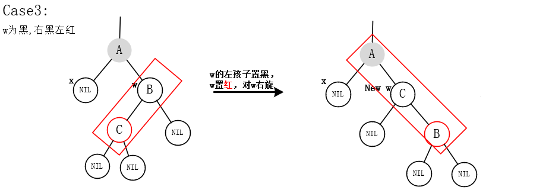
	
- **case4**：w为黑，且w的右孩子为红，左孩子任意。
	
	操作：x的父节点颜色下移给w结点，x的父节点置黑，w的右孩子置黑，对x的父节点左旋，设置x为根节点。

	思想： 主要思想是“**去除x额外的黑色从而把x变成单重黑色结点**”。为了做到这样，同时也需要保持黑高，那么必定要对父节点进行左旋从而弥补左子树的黑高(移除x的额外黑色后左子树的黑高会减一）。那么为了保持左子树的黑高，父节点(A)必定要置黑，同时w的右孩子也需要置黑，同时右旋后成为父节点的B需要保持与原来的父节点(A)一致的颜色。
	
	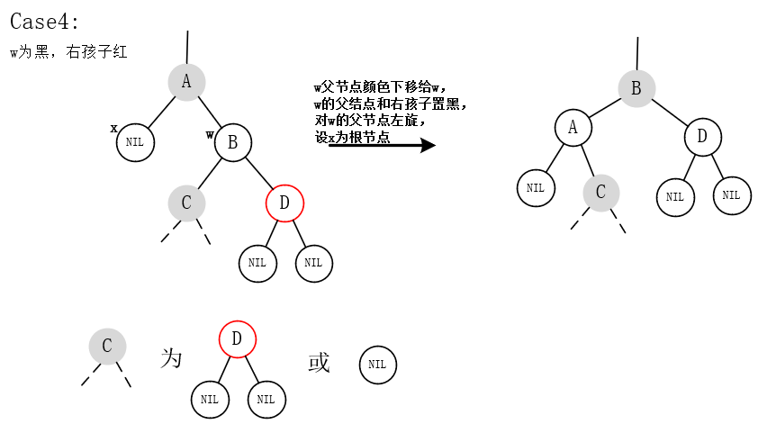
## 总结

红黑树作为一种特殊的二叉查找树，它的各种操作首先是以对应的二叉查找树的操作以基础，在此之上由于它特殊的颜色性质(最主要的就是**不能有两个连续的红色结点** + **黑高一致**)，进行对应操作的后续`FIXUP`过程，插入和删除操作有很高的相似性。

- 以**保持黑高一致**为标准，都是以操作节点为红色作为切入点。
	- 插入操作**置插入节点z为红**，从而保持黑高一致。
	- 删除操作以真正被删除的结点(后继结点y)的颜色 **y-original-color 是否为红**作为区分，为红则不需要调整，为黑则需要调整(破坏了黑高一致)。
	
- 以**破坏了什么性质作为切入点**进行case的区分。

  - 插入操作z置红，那么对应的会破坏“**不能有两个连续的红结点**”。结点z在插入前为NIL结点，那么其只有父节点，则**以父节点是否为红**进行操作。父节点为黑，不需要进行任何操作；父节点为红的情况下，以叔父结点作为区分点。叔父结点为红，case1；叔父结点为黑，那么则以结点z所在子树是不是**一条直线**，不是则转换为一条直线，方便后续的右旋/左旋操作。

    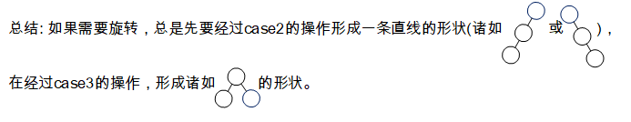

  - 删除操作真正删除的结点为y，那么在y为黑的情况下破坏了“**保持黑高一致**” ，继而给出的解决方法是**给X结点加一层额外的黑色以保持黑高不变**，并不断将X结点上移直至X结点的color属性为红色或X是根节点。

    X为黑的情况下，父节点黑色红色都可以，那么则**以其兄弟节点W颜色去区分**case。

    - 兄弟结点为红，case1，需要想办法将W结点转换为黑色，那么则进行旋转操作，对应的为了保持旋转前后黑高保持不变，原来的兄弟结点W和父节点置反后在旋转。

      > 置反在旋转的本质：旋转操作（左旋）会导致被旋转的一侧（右子树）少了一个结点，那么为了保持父节点的黑高保持不变，最好的方法是父结点颜色下移至兄弟结点（在左旋后会成为父结点的结点），同时根据情况置父结点为不同的颜色（以保持左右子树黑高为准）

    - 兄弟结点为黑，则以兄弟结点孩子节点作为区分。孩子结点全为黑，case2，W置红，X上移（左右子树黑高均-1）；右黑，case3，相似于插入操作的case2，**要将其转为一条直线**，所以W和左孩子置反再旋转成为case4，此时相应的往结点少的那一侧进行旋转，同时W的父结点颜色下移给W，在置父结点和右孩子为黑。

      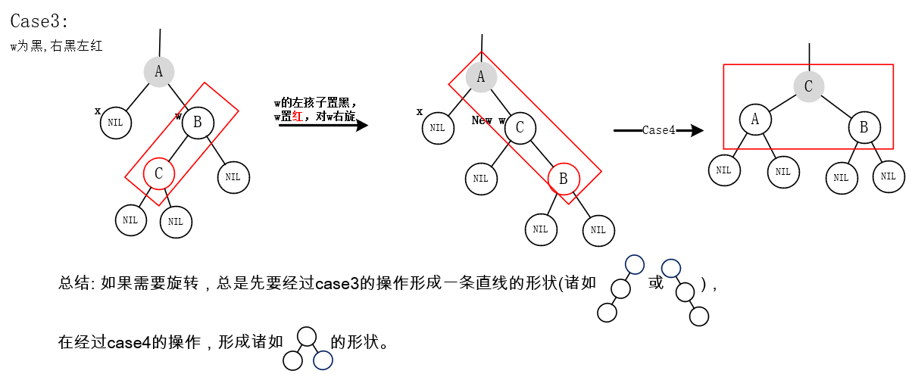

## HashMap中的红黑树操作(To do)

### 源码解析

- `putTreeVal()`

- 