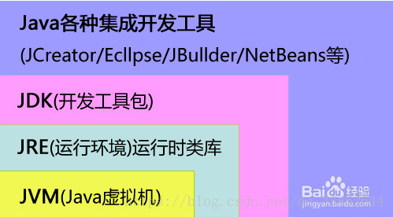
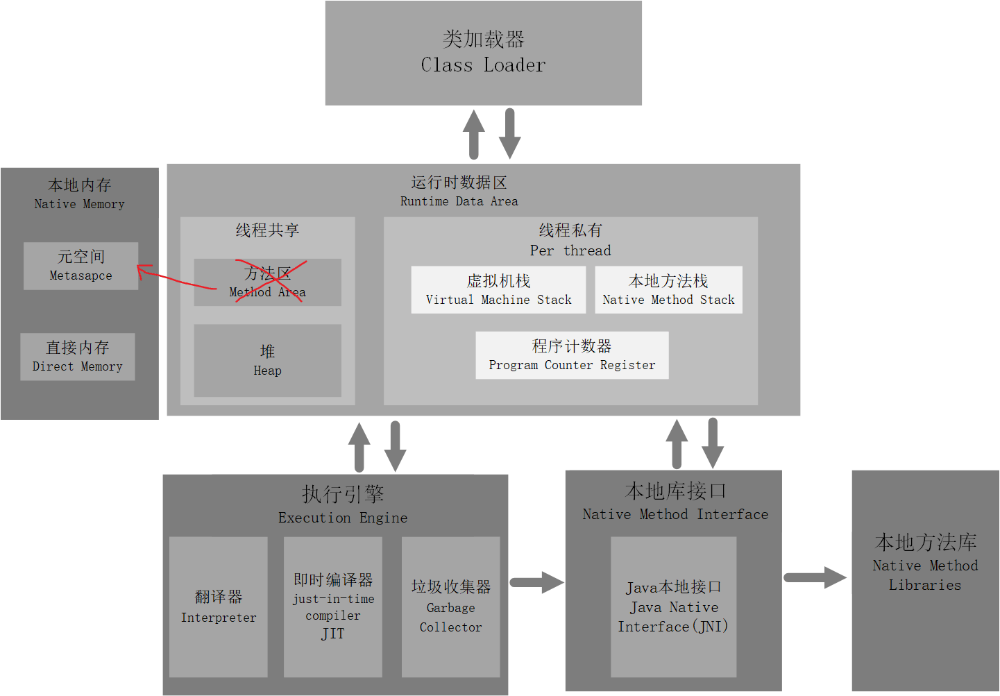
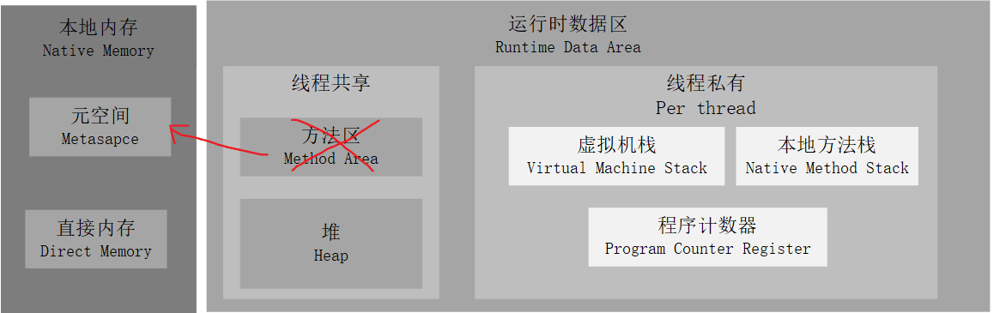
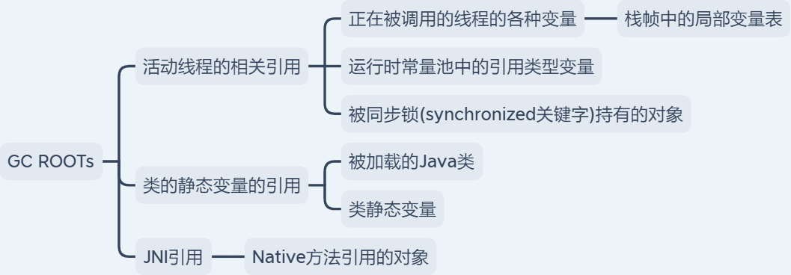

# JVM

## 基本概念

1. **JRE, JDK, JVM。**

   JVM: Java virtual machine, Java虚拟机。 位于在操作系统之上，负责**执行 字节码中指令**。Java语言的可执行性正是建立在JVM之上，任何平台只要装了**针对该平台的JVM**，那么就能**执行经过编译的字节码文件**。这就是“一次编译，多次运行”。

   > Java程序(.Java)    编译--》 Java字节码(.class, .jar)    解释----》 JVM   执行----》 操作系统。
   >
   > Java语言是编译+解释语言，Java程序由Javac编译成字节码后，用JVM解释。

   

   JRE: Java runtime environment Java运行时环境。JRE =  JVM + JVM工作所需要的一些类库

   JDK: Java development kit，Java开发工具包。JDK = JRE + 一堆Java开发工具 + 一些基础类库

   > JDK是给开发人员使用，JRE和JVM是给普通用户使用。

   

2. JVM规范极其实现。

   JVM广义上是指[Java虚拟机规范](https://docs.oracle.com/javase/specs/jvms/se8/html/index.html)，有很多的实现，其中最流行的是Oracle的**HotSpot**。狭义上，我们一般讨论JVM时，都指的是HotSpot。

3. JVM整体架构。

   

## 内存区域

### 堆

Java 虚拟机所管理的内存中**最大**的一块，在虚拟机启动时创建。

此内存区域的唯一目的就是**存放对象实例**，Java里**“几乎”**所有的对象实例都在这里分配内存。

堆是垃圾收集器管理的内存区域，即**GC**发生的地方。因为大部分现代垃圾收集器GC是基于**分代收集理论**设计，所以从回收内存的角度来看，堆经常被分为”新生代、老年代、永久代”或“Eden、From、To”等，但其实并不是JVM堆的固有内存分局。

Java堆既可以被实现成**固定大小**的，也可以是**可扩展**的，不过当前主流的Java虚拟机都是按照可扩展来实现的（通过参数**-Xmx**和**-Xms**设定）。

如果在Java堆中没有内存完成实例分配，并且堆也无法再扩展时，Java虚拟机将会抛出**OutOfMemoryError**异常。

### 方法区

方法区用于存储已**被虚拟机加载**的**类信息**、**常量**、**静态变量**、即时编译器(JIT)编译后的**代码缓存**等数据。同时也包括运行时常量池。

##### 常量池、运行时常量池、字符串常量池

JVM常量池：.class文件的常量池，可以理解为一张表，虚拟机指令根据这张常量表找到要执行的类名，方法名，参数类型，字面量等信息。常量池只有类文件在**编译**的时候才会产生，而且是存储在类文件中的。在常量池中保存的也是引用，具体的对象在堆上分配。

运行时常量池：首先常量池是在.class文件中的，当该类**被加载**时，它的常量池信息**被放入JVM运行时数据区-方法区-运行时常量池**。运行时常量池是在方法区，而且可在JVM运行期间动态向运行时常量池中写入数据。

字符串常量池：字符串常量池里的内容是在类加载完成，经过验证，准备阶段之后在**堆中生成**字符串对象**实例**，然后将该字符串对象实例的**引用值**存到**string pool**中（string pool中存的是引用值而不是具体的实例对象，具体的实例对象是在堆中开辟的一块空间存放的）。string pool在每个HotSpot VM的实例只有一份，**被所有的类共享**。在jdk1.8后，将String常量池放到了**堆中**。

##### 方法区被替代为元空间

- JDK1.7之前，方法区包含运行时常量池，这个运行时常量池逻辑包含字符串常量池。
- JDK1.8之后，方法区被元空间取而代之，此时方法区还是包括运行时常量池，只不过实现方式换成了本地内存上的元空间。但字符串常量池被单独拿出来放到了堆中。

如果方法区无法满足新的内存分配需求时，将抛出OutOfMemoryError异常。

### 程序计数器

程序计数器是一块较小的内存空间，可以看作是**当前线程所执行的字节码的行号指示器**。字节码解释器工作时就是通过**改变这个计数器的值来选取下一条需要执行的字节码指令**，它是程序控制流的指示器，分支、循环、跳转、异常处理、线程恢复等基础功能都需要依赖这个计数器来完成。

另外，为了线程切换后能恢复到正确的执行位置，**每条线程都需要有一个独立的程序计数器**，**各条线程之间计数器互不影响**，独立存储，我们称这类内存区域为“线程私有”的内存。

程序计数器的两个作用：

- 字节码解释器通过改变程序计数器来依次读取指令，从而实现**代码的流程控制**。
- 在**多线程**的情况下，程序计数器用于记录当前线程执行的位置，从而当线程被切换回来的时候能够知道该线程上次运行到哪儿了。

程序计数器是**唯一一个不会出现 OutOfMemoryError** 的内存区域，它的生命周期**随着线程的创建而创建，随着线程的结束而死亡**。

### 虚拟机栈

Java虚拟机栈（Java Virtual Machine Stack）也是线程私有的，它的生命周期与线程相同。

虚拟机栈描述的是Java方法执行的**线程内存模型**：每个方法被执行的时候，Java虚拟机都会同步创建一个**栈帧**用于存储**局部变量表**、**操作数栈**、**动态连接**、**方法出口**等信息。

**栈帧**（对应一个方法）

- 局部变量表：基本数据类型(8种)，对象引用(reference类型)，returnAddress类型(指向下一条字节码指令的地址)。

  > 这些数据类型在局部变量表中的存储空间以局部变量槽(slot)表示，一个变量槽为32位，相应的Long和double类型占两个变量槽，其他数据类型只占一个。

- 操作数栈：

- 动态链接：

- 方法出口：

虚拟机栈会出现两种错误：

- **StackOverflowError**: 线程请求的栈深度大于虚拟机所允许的栈深度。
- **OutOfMemoryError**: Java虚拟机栈的**内存大小可以动态扩展**，但如果**在动态扩展时无法申请到**足够内存空间，则OOM。

### 本地方法栈

本地方法栈（Native Method Stacks）与虚拟机栈所发挥的作用是非常相似的，其区别只是**虚拟机栈为虚拟机执行Java方法（也就是字节码）服务**，而**本地方法栈则是为虚拟机使用到的本地（Native）方法**服务。

方法执行完毕后相应的栈帧也会出栈并释放内存空间，也会出现 `StackOverFlowError` 和 `OutOfMemoryError` 两种错误。

## 垃圾回收

Java 的自动内存管理主要是针对**对象内存的回收和分配**，垃圾回收主要发生在JVM内存模型中的**堆**上，这是堆的内存模型。

大部分情况，对象都会首先在 Eden 区域分配，在一次新生代垃圾回收(Minor GC)后，如果对象还存活，则会进入 s0 或者 s1，并且对象的年龄还会加 1(Eden 区->Survivor 区后对象的初始年龄变为 1)，当它的年龄增加到一定程度（默认为 15 岁），就会被晋升到老年代中。

### 对象已死

**1. 引用计数法**

在对象中添加一个引用计数器，每当有一个地方引用它时，计数器值就加一；当引用失效时，计数器值就减一；任何时刻计数器为零的对象就是不可能再被使用的。

但有其缺陷，譬如最简单的对象之间相互**循环引用**的问题这一方法就无法解决。

**2. 可达性分析法**

基本思想：通过可达性分析来判定对象是否存活。

选取一系列**GC Roots**，从这些节点开始，根据引用关系向下搜索，搜索过程所走过的路径称为“引用链”。

如果某个对象到GC Roots间没有任何引用链相连（不可达），则说明此对象不再被使用。

> 找出所有活跃对象，把其余空间判定为“无用”。

**2.1 GC ROOT**

### GC算法

**1. 基本操作**

- 标记：用**可达性分析法**找到**活跃对象**，然后剩下来的目标就是回收"无用"对象。
- 清除：直接回收未被标记的对象(无用对象)
  - 弊端：碎片问题。带来内存不连续
- 复制：提供一个**额外的空间**，将需要存活的对象复制到额外空间上去，然后清除原内存空间。
  - 好处：解决了就地清除方法带来的碎片问题
  - 弊端：需要提供额外的空间
- 整理：就地索引所有需要存活的对象，然后按照索引顺序将对象依次就地整理到内存中，清除剩余内存空间。
  - 弊端：对象的引用关系非常复杂，实现起来不好实现。

**2. 常见GC算法**

- 标记-清除
- 标记-复制
- 标记-整理
- 分代收集

## 类加载

