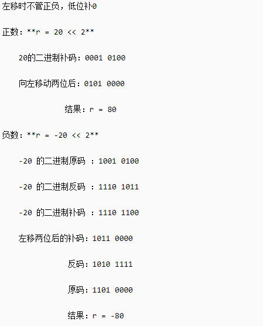
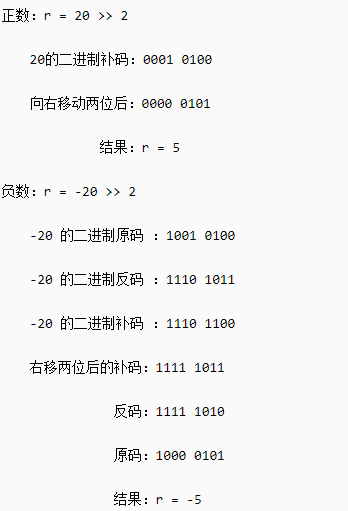
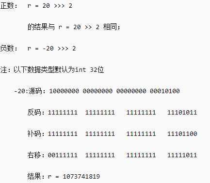
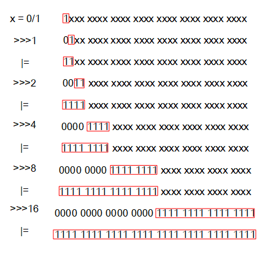

# 位操作笔记

## 机器数

在计算机中所有数据都是以二进制的形式储存的，而一个由0和1构成的数值有四种表示方式，分别是原码、反码、补码。需要注意的是，计算机中只存储整数的**补码**。

- **原码**

1. 正数的原码就是它本身。

   整数+10的原码：0000 1010

2. 负数用最高位置1(符号位)表示负数

   整数-10的原码：1000 1010

- **反码**

1. 正数的反码 = 原码

   整数+10的反码：0000 1010

2. 负数的反码：符号位不变，数值位按位取反。

   整数-10的原码：1111 0101

- **补码**

1. 正数的补码 = 原码

   整数+10的反码：0000 1010

2. 负数的补码 = 反码 + 1

   整数-10的反码：1111 0110

   总结：正数的补码 = 原码，负数的补码 = 数值位按位取反 + 1。

## 位操作符

Java中的位操作符包含：与（&）、或（|）、非/取反（~）、异或（^）、左移、右移。在这六种中，只有取反是单目操作符，其他都是双目操作符。

与（&）：129 & 128 = 128

或（|）：129 | 128 = 129

非（~）：所有位数按位取反，包括符号位。

异或（^）：两个操作数的位中，相同则结果为0，不同则结果为1。

- 左移

  m << n：把m表示的二进制数的补码**带符号位左移**n位，**高位移出，低位补零**。

  当n大于该类型的最大位数，则进行取模，如对Integer左移34位，则实际左移两位。

  一般意义下，m左移n位 = m * 2^n，但需要注意值溢出的情况。

  一般在源码阅读中会发现用`<<`代替 **×2** 从而提高效率。

  

- 右移

  - 带符号右移(>>)

    m >> n：把m表示的二进制数的补码右移n位，**符号位是什么高位就补充什么**。

    如果该数为正，则高位补0，若为负数，则高位补1。

    

  - 无符号右移(>>>)

    m >>> n：把m表示的二进制数的补码右移n位，高位补0。
  
    

## 常见操作

- 判断奇偶

  ```java
  //判断一个数是否为偶数
  public boolean isEvenNum(int n){
      return (n & 1) == 0;
  }
  ```

  > 二进制下偶数的末位肯定是0，(n & 1) == 0；而奇数的末位肯定是1，那么 (n & 1) == 1.


- 不借助第三方变量交换两个数的值(`a !=b`的前提下，不然最后a,b均为0)

  ```java
  a = a ^ b;
  b = a ^ b;
  a = a ^ b;
  ```

  > 本质是利用了位运算的可逆性，使用异或运算来操作。
  >
  > 异或运算的基本公式： a ^ a = 0； a ^ 0 =a。（和自己异或结果为0，和0异或结果为自己）
  >
  > 异或运算性质: 1. 交换律
  >
  > ​						 2. 结合律：(a^b)^c == a^(b^c)
  >
  > ​						 3. 自反性：a ^ b ^ b = a ^ (b ^ b) = a ^ 0 = a
  >
  > 上述代码： 2. b = a ^ b = (a ^ b) ^ b = a ^ (b ^ b) = a
  >
  > ​					3. a = a ^ b = (a ^ b) ^ a = (a ^ a)  ^ b = 0 ^ b =b

- 移除最后一个1

  ```java
  a = n & (n - 1)
  ```

- 获取最后一个1

  ```java
  diff = (n & (n - 1)) ^ n
  ```

## 实际应用

位操作在平时的编码中很少用到，但因为其对机器数直接操作效率大大提升，在很多框架的源码中都可以见到各种位操作算法。

1. `HashMap`中的`tableSizeFor(int cap)`方法

   ```java
   //返回大于等于cap的最小二进制整数
     static final int tableSizeFor(int cap) {
         // cap已经是2的幂次时减一后在进行运算
         //否则会出现cap = 2, 实际输出为4(期望输出为2)
         int n = cap - 1;
         //进行高位1之后所有位置一的操作
         n |= n >>> 1;
         n |= n >>> 2;
         n |= n >>> 4;
         n |= n >>> 8;
         n |= n >>> 16;
         //最后加一，并检验是否在合理范围内
         return (n < 0) ? 1 : (n >= MAXIMUM_CAPACITY) ? MAXIMUM_CAPACITY : n + 1;
     }
   ```

   整个方法的核心是 `n |= n >>>1`， `>>>`操作为无符号右移，移位后高位补零，之后在进行异或操作。 `n |= n >>> x位`操作的本质是对**二进制n的最高位1的后x位**进行**置一**操作，当进行到最后一步`n |= n >>> 16`即完成了32位的 **二进制n的最高位1之后的所有位全部置一**的操作在进行最后的**加一**操作也就是完成了 **大于等于n的最小的二进制数**。
   首先**找到等于大于n的最小的二进制数**可以转换为：**n的二进制的最高位1的前一位置1，后面都置零**(除非n正好为二次幂，则返回n）。比如n=33，则**0010 0001**转换为**0100 0000**，为了实现这一目的，我们可以分为两步来走：

   - 将n的二进制的最高位1的后面全部置1，即**0010 0001**变为**0011 1111**。
   - +1操作，即**0011 1111** + 1 = **0100 0000** (64)。

   其中`n |= n >>>1`完成的上述步骤1，这里我们用图示来进行形象解释。需要注意的是，实际函数中n的最大值为`MAXIMUM_CAPACITY`即(2^30)，这里只是为了解释针对32位的int，最后一步为`n |= n >>>16`能保证最高位1之后的每一位都置一。

   

   其中`int n = cap - 1;` 的作用为在进行置一操作前先减一，否则当n正好为二次幂时，最后返回的结果为**2n**（实际期望返回结果为n）。所以可以先减一（此时高位1为原高位1的后一位），再进行**高位1之后位 置一**再**加一**的操作，最后得到n。

## 参考文献

- [Java基础-原码反码补码](https://www.cnblogs.com/yinzhengjie/p/8666354.html)
- [聊聊Java中的位运算：与、或、非、异或、左移、右移、无符号右移](https://cloud.tencent.com/developer/article/1587912)

- [java中的位操作、移位操作](https://www.cnblogs.com/zhjh256/p/12540585.html)
- [Java中的左移、右移详细分析](https://blog.csdn.net/kaixuansui/article/details/92806813)