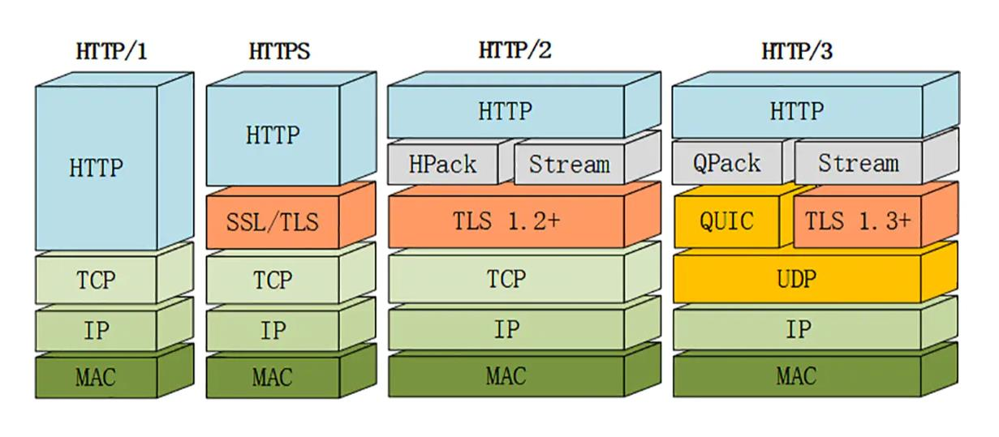

## HTTP总结

### 1. HTTP版本演变

##### HTTP1.0

- 短连接

  每次request都需要新建TCP连接，造成大量开销浪费。

- 串行请求

  一次请求发出去了，只有等待该请求对应的响应返回之后才会发送第二个请求。

##### HTTP1.1

- 长连接

  连接建立之后，只有当一方**显式地**提出断开连接才会四次挥手。

  头部 Connection：keep-alive

- 管道(pipeline)传输

  可以一次发送多个请求，不用等待前一个响应回来之后才能发送下一个请求。

  **问题**：队头堵塞，虽然可以一次发送多个请求，但服务端仍然是**按照顺序响应**，第一个响应需要处理很久的话之后的响应仍然需要很久才能返回。

- 虚拟主机

  支持多个域名解析到同一个IP上

##### HTTP2

- HTTPS密文传输

- HPACK

  头部压缩算法：多个请求中重复的header部分会被压缩，而不是重复传递。

  客户端和服务端同时维护一张头部表，所有字段都存储在这张表中，并生成索引号。对于重复的头部，直接发送索引号而不是字段内容。

- 服务端推送

  相比于以前只能 client request, server response的模式，server也可以主动push，主动向客户端推送。

- 多路复用

  同一个连接中可以并发多个请求或回应，而不用按照顺序一一对应。

  > pipeline模式保证了同一个连接中多个请求，但响应仍然是按序逐个发送。
  >
  > 多路复用：响应也可以并发响应，不用再按序响应，解决了队头堵塞问题。

  基础：**数据流**

  - HTTP/2 的数据包不是按顺序发送的，同一个连接里面连续的数据包，可能属于不同的回应。因此，必须要对数据包做标记，指出它属于哪个回应。

  - 每个请求或回应的所有数据包，称为一个数据流（ Stream ）。每个数据流都标记着一个独一无二的编号，客户端奇数，服务器偶数。

  - 客户端还可以**指定数据流的优先级**。

  - 基础：**二进制**：不再用纯文本传输，而是二进制传输。整个请求分为：头部帧和数据帧。

- 问题

  多路复用之后，多个HTTP请求复用一个TCP连接，TCP发生了丢包问题之后，同一个TCP连接的所有HTTP请求都要等待这个丢掉的包重传。相当于丢包情况下，为解决队头堵塞问题的多路复用还是没用。

  > 对于丢掉的这个TCP包，不知道属于哪个HTTP响应，所以只能所有请求都等待它重传回来。

##### HTTP3

- QUIC

  把底部TCP改为UDP，同时采用QUIC协议来保障可靠性传输。

- 解决TCP丢包问题

  底部当成一个个流，对于某个流丢包，只阻塞这个流。

  > 这里的流类似于HTTP2中的一个HTTP请求。

### 2. HTTPS

HTTPS = HTTP + SSL/TLS。

##### SSL/TLS提供功能：

- 加密：用对称加密算法加密明文，用非对称加密算法加密session_key。

  - 加密时公钥加密，私钥解密。
  - 电子签名：私钥签名，公钥验证。

- 身份认证：

  数字签名：提供身份认证。

  私钥**加密摘要**，公钥解密摘要digest，同时用session_key解密密文，对原文进行哈希，比较哈希之后的摘要跟公钥解密得到的摘要。

  假公钥问题：引入可信第三方生成数字证书。

  把发送方的公钥用CA私钥加密成数字证书，接受方用**CA公钥**解密得到发送方公钥。

- 数据一致性：数字摘要，hash算法。

##### TLS三次握手

- 客户端发送client hello：客户端支持TLS版本号，**支持的加密算法**，**随机数c**等。

- 服务端发送server hello：确认TLS版本号，选定的加密算法，随机数s，**服务器证书**

  客户端收到后：1. CA公钥解密得到服务器公钥，生成随机数pre-master。

  2. 客户端随机数c+服务端随机数s+pre-master=session_key。

- 客户端发送client key exchange：发送 服务器公钥加密后的 pre-master。

  服务端收到后：服务端私钥解密得到pre-master，客户端随机数c+服务端随机数s+pre-master=session_key。

### 3. GET和POST

##### GET

1. 请求从服务器**获取资源**（相当于只读操作）。

2. 安全且幂等。

   反复`回退/前进`操作无害

3. get方法的请求参数拼接在URL后面。
4. get方法浏览器会把header和data一起发送，服务器处理完成后返回数据和200 ok状态码。

##### POST

1. 向 URI 指定的资源**提交数据**，把数据放在body里，拼接好post请求头，提交给服务器。

2. 不安全且不幂等。

   反复`回退/前进`操作会重新提交请求

3. post放的请求参数以键值对的形式放在请求体body中

4. post请求，浏览器先发送header，服务器响应100；浏览器再次发送data，服务器响应200 ok

### 4. 无状态

无状态协议：浏览器对于事务的处理没有记忆能力。解决方式：服务端session和客户端cookie。

#### session和cookie

##### 1. session和cookie如何产生？

​        在浏览器第一次向服务端发送请求时，服务器会开辟一段session空间，生成sessionID，并在响应头中set-cookie: JSESSIONID=xxx；客户端收到响应后，在本地存储cookie，其中包含了JSESSIONID=xxx，之后的每次请求头中都会带有cookie。

##### 2. session的缺点

​        分布式session问题，主要还是因为session是存在某一个服务器上的。解决方法：session复制，session集中存储。

##### 3. cookie

cookie分为会话cookie和永久性cookie。

- 会话cookie会在浏览器关闭后自动删除。
- 永久cookie通过`Expires`和`MAX-Age`指令来指定什么时候删除/过期。

### 5. 状态码

- 1XX- 提示信息型，服务器收到请求，需要请求者继续操作。
  - 100 continue：服务器收到了请求的初始部分，并且请客户端继续发送。
- 2XX- 成功型，请求成功收到，理解并处理。
  - 200 OK：客户端请求成功
- 3XX - 重定向，需要进一步的操作以完成请求。
  - 301 Move Permanently：请求资源以及不存在了，需要用新的URL再次访问。
  - 302 Found：临时重定向，请求的资源还在，但暂时需要用另一个URL来访问。
- **4**XX - **客户端发送报文**错误，请求包含语法错误或无法完成请求。
  - 400 Bad Request - 客户端请求有语法错误，不能被服务器所理解
  - 403 Forbidden：服务器禁止访问资源 404 Not Found：请求资源不存在，可能是输入了错误的URL
- **5**XX - **服务器内部处理**错误，服务器在处理请求的过程中发生了错误。 
  - 500 Internal Server Error：服务器内部发生了不可预期的错误
  - 502 Bad Gateway：服务器作为网关或代理时返回的错误码，请求后端服务器发生错误。 
  - 503 Server Unavailable：服务器当前不能处理客户端的请求，一段时间后可能恢复正常。

#### 6. 常见请求头

- 通用标头：可以出现在请求标头和响应标头

  - Date:
  - Cache-Control:
  - Connection：决定是否长连接。keep-alive

- 实体标头：描述信息正文内容的HTTP标头

  - Content-Length:
  - Accept-Encoding: 请求头
  - Content-Encoding: 响应头

- 请求标头：

  - Host：服务器域名
  - Accept和Accept-Charset：客户端能处理的类型

- 响应标头：

  Keep-Alive：非持久化连接的存活时间

  Set-Cookie：
