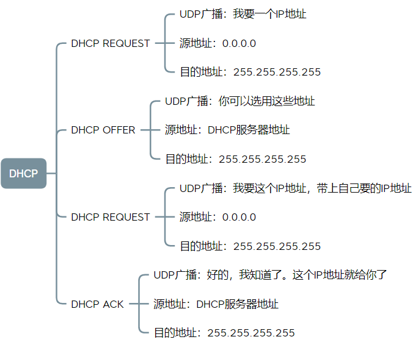

# TCP/IP协议簇总结

## IP

### 基本概念

#### 1. 地址构成

IP地址 = 网络号 + 主机号。

为了把网络号与主机号区分开来，从一开始的分类地址(ABC)到CIDR(无分类地址)再到子网掩码。

子网掩码作用：1. IP地址 AND 子网掩码 = 网络号。 2. 子网掩码还可以从主机地址中借位从而用于切割子网。

#### 2. IP地址和MAC地址的区别

- 首先MAC地址属于数据链路层，IP地址属于网络层。

- MAC地址用于**直连网络**中点对点的通信，这里的直连网络就是指由交换机搭建起来的以太网。
  而IP地址包含网络号+主机号，当两个设备不在一个网络内时，需要**先通过路由器**转发到对应的网络，**再通过交换机**转发到对应的主机。

  > 路由器的每个端口都有IP和MAC地址，交换机的端口没有MAC地址。
  
- 在整个转发过程中，IP地址不变，而从一个网络到另一个网络的图中，MAC地址不断变化。
  MAC地址在一个局域网中是唯一的，但在不同网络中是不唯一的。IP地址在全部网络中是唯一的。

- ARP协议：IP地址转MAC地址。由路由器转发到对应的网络后，使用ARP协议得到MAC地址，然后发送到对应的目的MAC地址主机。

#### 3. 路由控制

根据目标IP地址和路由器中的路由表进行转发(下一跳)，到达目标网络后由交换机发送到具体的目标地址。
在路由器中的路由表结构表中记录着下一跳地址，当出现多个匹配地址时使用最长匹配原则。

#### 4. 相关协议

##### 1). DHCP

在整个过程中用的都是**UDP广播**，每次都带有一个事务ID，DHCP客户端收到跟自己无关的广播信息则丢掉。

##### 2). NAT

公共IP地址+端口号 = 私有IP地址。NAT私有网络内，两个**端口相同**的计算机经过NAT转换------》两个IP相同但端口不同，这样在外部看来这就是一个IP地址。

##### 3). ICMP

ICMP: Internet Control Message Protocol，也就是互联网**控制**报文协议。
主要功能：确认 IP 包是否成功送达目标地址、报告发送过程中 IP 包被废弃的原因和改善网络设置等。

分为查询报文类型和差错报文类型。
- 查询报文类型：，判断所发送的数据包是否已经成功到达对端的一种消息(ping)
  - 0：回送应答 Echo Reply，
  - 8：回送请求 Echo Request，
- 差错报文类型：
  - 3：目标不可达 Destination Unreachable
  - 4：原点抑制 Source Quench
  - 5：重定向或改变路由 Redirect
  - 11：超时 Time Exceeded：有IP报文的TTL(Time To Live)控制，代表可以经过的跳数。

##### 4). IGMP

 IGMP：Internet Group Message Protocol，因特网组管理协议。工作在主机（组播成员）和最后一条路由之间。

## TCP

### 1. 报文头部格式

- 端口号(16位)：源端口号，目标端口号各16位
- 序列号(32位)：序号：Seq，本报文段发送的数据组的**第一个字节的序号**；确认序列号：ACK，下一次期望收到的序列号，即确认此序列号之前的都收到了。
- 状态位：SYN(发起连接)，ACK(回复)，RST(重新连接)，FIN(结束连接)等
- 窗口大小(16位)：用作拥塞控制的窗口大小值。
