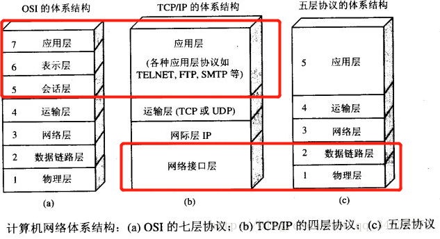
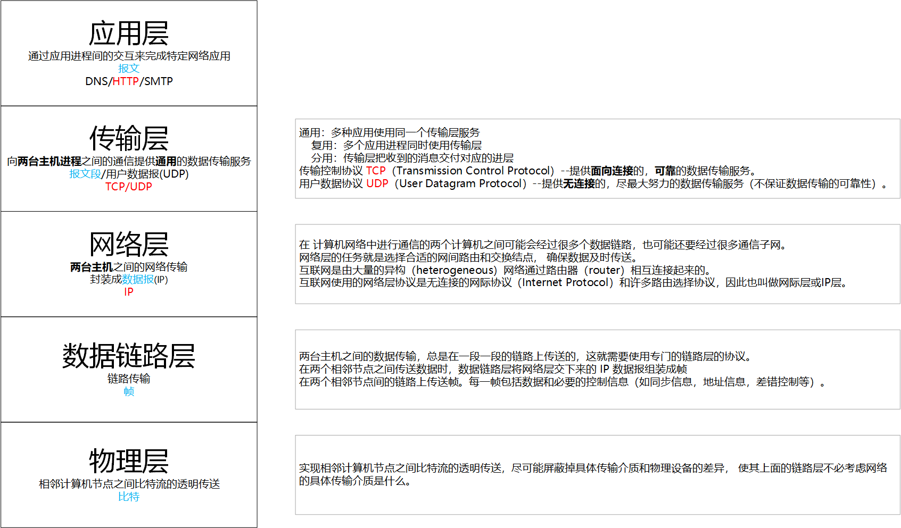
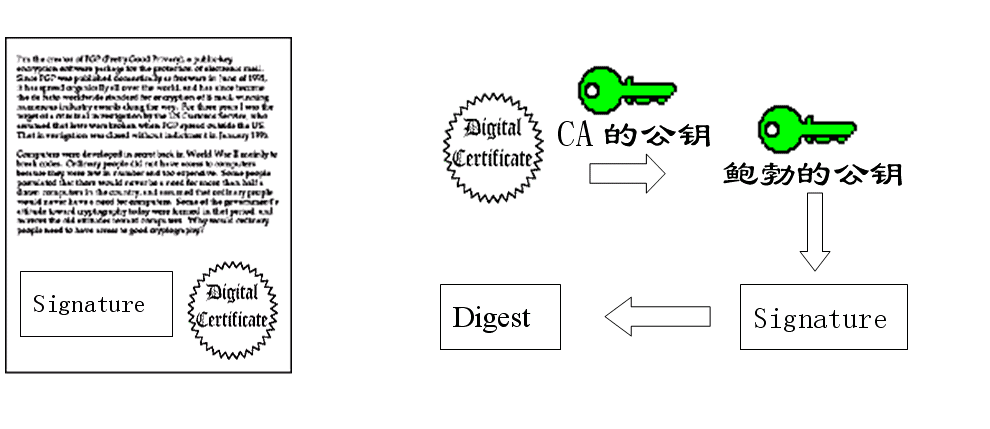
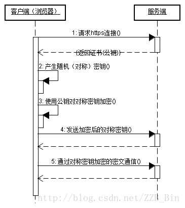
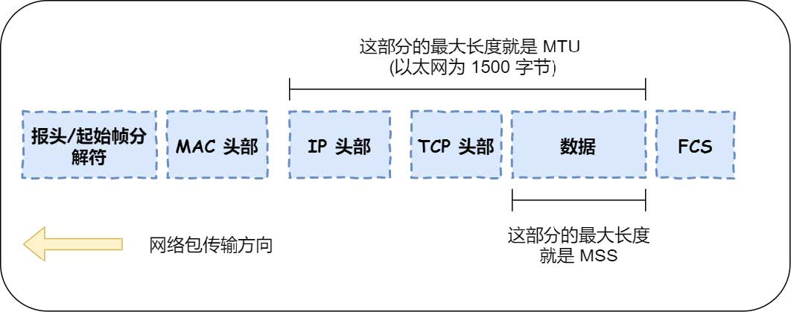
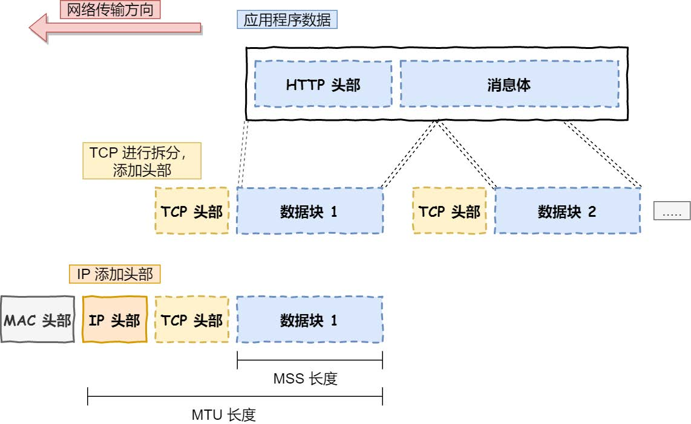

# 计网

## 应用层

### HTTP

#### 状态码

- 1XX- 提示信息型，服务器收到请求，需要请求者继续操作。

- 2XX- 成功型，请求成功收到，理解并处理。
  - 200 OK：客户端请求成功
  
- 3XX - 重定向，需要进一步的操作以完成请求。
  - 301 Move Permanently：请求资源以及不存在了，需要用新的URL再次访问。
  - 302 Found：临时重定向，请求的资源还在，但暂时需要用另一个URL来访问。
  
- **4**XX - **客户端发送报文**错误，请求包含语法错误或无法完成请求。
  - 400 Bad Request - 客户端请求有语法错误，不能被服务器所理解
  - 403 Forbidden：服务器禁止访问资源 404 Not Found：请求资源不存在，可能是输入了错误的URL

- **5**XX - **服务器内部处理**错误，服务器在处理请求的过程中发生了错误。 
  - 500 Internal Server Error：服务器内部发生了不可预期的错误
  - 502 Bad Gateway：服务器作为网关或代理时返回的错误码，请求后端服务器发生错误。 
  - 503 Server Unavailable：服务器当前不能处理客户端的请求，一段时间后可能恢复正常。

#### 面试题

1. URL与URI的区别？

   URI： Uniform Resource Identifier 统一资源**标志符**

   URL： Uniform Resource Locater 统一资源**定位符**

   URN： Uniform Resource Name 统一资源**名称**

   URI是抽象的定义，不管用什么方法表示，只要能定位一个资源，就叫URI，本来设想的的使用两种方法定位：1，URL，用地址定位；2，URN 用名称定位

2. Get与Post区别？

   Get： 请求从服务器**获取**资源，相当于`只读`操作，是安全且幂等的。

   Post：向 URI 指定的资源提交数据，数据就放在报文的 body 里，是`新增或提交数据`操作，可能修改服务器上的资源，所以不安全且不幂等。

### HTTPS

HTTPS = HTTP + SSL/TLS。HTTP协议是明文传输，不安全，所以套上了SSL的外层，即发送方把HTTP的明文用SSL协议加密后再发给网络层，而接收方传输层在收到之后进行解密得到HTTP原文。

从密码学角度来说，HTTPS提供了三个功能。

- **加密**：基于非对称加密生成的对称密钥加密算法。

  - 非对称密钥加密：

    A生成自己的密钥对（公钥A，私钥A），同时B也生成自己的密钥对（公钥B，私钥B）。然后把公钥发布出去。

    B给A发消息：B把发送消息用公钥A加密，A收到后用自己的私钥A对密文解密得到明文。

    A给B发消息：A把发送消息用公钥B加密，B收到后用自己的私钥B对密文解密得到明文。

    > 要给谁发消息就用**接收方的公钥**加密，同时接收方收到后用自己的私钥解密。
    >
    > 加密时 公钥加密，私钥解密。
    >
    > 同时可用于签名上，私钥签名，公钥负责验证。

  - **密钥交换**部分采用非对称密钥加密，生成用于后续两方通信的session key。

- **数据一致性**：数字摘要(解决数据的**完整性**问题)。

  - 摘要：把任意长度的数据**压缩**(Hash)成一个固定长度的字符串。

    发送方把自己发送的信息M hash成一个摘要，把这个摘要附加在M之后一起发送。<m, digest>

    接收方收到后，解密之后对信息M重新计算其Hash值，并且将计算出来的Hash值与信息所附带的摘要digest进行对比，一致则说明信息没有被篡改。

- **身份认证**：

  - 数字签名：发送方私钥对摘要加密（解决中间人攻击问题，确保信息确实来自于发送方A而不是中间人）

    - 发送方**A**用自己的私钥对上述的摘要进行加密，形成<m, signature>。

    - 接收方**B**收到后用发送方的公钥解密得到<m, digest>，再用session key解密得到原文，用Hash算法对原文生成摘要，比较自己计算的摘要与信息中附带的digest，一致则说明信息没有被篡改且来自于发送方

      > 因为签名这一步用的是发送方自己的私钥，所以确保了确实来自于发送方A而不是中间人

    - 但这样还不够，一个第三方**C**可以生成自己的私钥公钥对，然后偷偷改接收方**B**的公钥，将其公钥改为自己的公钥，后续假冒**A**与**B**进行通信。（假公钥问题）

  - 数字证书：（解决了假公钥问题）
  
    - 针对解决上述问题，引入了可信第三方作为证书中心(CA)。
  
    - 首先发送方A将自己的个人信息去CA进行注册并且得到一个数字证书。
  
      
  
    - 之后发送信息时发送<m, signature, Digital Certificate>
  
    - 接受方C收到后，用CA的公钥，A的公钥，一步步解开并最后验证。
  
      
  
      > 整个流程的要点在于：CA的公钥是”真实“的。CA的公钥是可查的，无法伪造他们的公钥。

#### SSL

本质：非对称加密算法（RSA）交换对称密钥 + 数字证书验证身份 + 对称密钥加解密数据。

1. SSL握手（基于RSA算法）

   - A与B通过TCP建立连接。
   
   - A发送HTTPS请求，传送协议版本号，**支持的加密算法**，**随机数**等。
   
   - B把**CA证书**(其中包含B的公钥)，**选定的加密算法**，**随机数**传回给A。
   
   - A收到CA证书，验证证书有效性，并对证书进行解密。
   
     > 采用证书颁发机构的公钥解密得到 B的信息，B的公钥等等。
   
   - A生成一个随机字符串(后续的session key)，用**B的公钥**加密，将其发送。通知SSL握手结束。
   
   - B用私钥解密，得到session key，通知SSL握手结束。
   
   - SSL握手结束，后续采用session key进行加密。
   
     

## 传输层

### TCP

#### 概述

TCP把连接作为最基本的对象，每一条TCP连接都有两个端点，这种断点我们叫作套接字（socket），它的定义为**IP地址+端口号**即构成了套接字，例如，若IP地址为192.3.4.16 而端口号为80，那么得到的套接字为192.3.4.16:80。

他是一个**面向连接**，**可靠**，同时提供了**拥塞控制**。

- 面向连接：三次分手，四次分手。

- 可靠：序列号保证包顺序，确认号ACK表示我收到了哪些数据包。
- 流量问题：滑动窗口。
- 拥塞控制：慢开始，拥塞避免，快重传。
- 基于字节流：根据MSS（最大报文段大小）把数据切割成多个TCP报文。

**报文结构**

- **序号seq**：占4个字节，TCP连接中传送的字节流中的每个字节都按顺序编号。例如，一段报文的序号字段值是 301 ，而携带的数据共有100字段，显然下一个报文段（如果还有的话）的数据序号应该从401开始。
- **确认号ack**：占4个字节，是**期望收到对方下一个报文的第一个数据字节的序号**。例如，B收到了A发送过来的报文，其序列号字段是501，而数据长度是200字节，这表明B正确的收到了A发送的到序号700为止的数据。因此，B期望收到A的下一个数据序号是701，于是B在发送给A的确认报文段中把确认号置为701。
- **同步SYN**：在连接建立时用来同步序号。当SYN=1，ACK=0，表明是连接请求报文，若同意连接，则响应报文中应该使SYN=1，ACK=1。

#### 三次握手

> 最开始的时候客户端和服务器都是处于CLOSED状态。主动打开连接的为客户端，被动打开连接的是服务器。

1. TCP服务器进程先创建传输控制块TCB，时刻准备接受客户进程的连接请求，此时**服务器**就**进入了LISTEN（监听）状态**；
2. TCP**客户进程**也是先创建传输控制块TCB，然后**向服务器发出连接请求报文**，这时报文首部中的同部位SYN=1，同时选择一个初始序列号 seq=x ，此时，TCP客户端进程进入了 SYN-SENT（同步已发送状态）状态。TCP规定，SYN报文段（SYN=1的报文段）不能携带数据，但需要消耗掉一个序号。
3. TCP**服务器**收到请求报文后，如果同意连接，则发出确认报文。确认报文中应该 **ACK=1，SYN=1，确认号是ack=x+1**，同时也要为自己初始化一个序列号 seq=y，此时，TCP服务器进程进入了SYN-RCVD（同步收到）状态。这个报文也不能携带数据，但是同样要消耗一个序号。
4. TCP**客户进程**收到确认后，还要向服务器给出确认。确认报文的**ACK=1，ack=y+1，自己的序列号seq=x+1**，此时，TCP连接建立，客户端进入ESTABLISHED（已建立连接）状态。TCP规定，ACK报文段可以携带数据，但是如果不携带数据则不消耗序号。
5. 当**服务器**收到客户端的确认后也**进入ESTABLISHED状态**，此后双方就可以开始通信了。
   

**为什么TCP客户端最后还要发送一次确认呢？**

> 这一段参考draveness的why系列博客

一句话概括：**主要是防止已经失效的连接请求报文突然又传送到了服务器，从而产生错误**。

1. 什么是一次连接？

   > The reliability and flow control mechanisms described above require that TCPs initialize and maintain certain status information for each data stream. The combination of this information, including sockets, sequence numbers, and window sizes, is called a connection.

   包括：**Socket**，**序列号**以及**窗口大小**。

   所以，建立 TCP 连接就是通信的双方需要对上述的三种信息达成共识，连接中的一对 Socket 是由互联网地址标志符和端口组成的，**socket用于唯一标记通信的双方**，**窗口大小主要用来做流控制**，**序列号是用来追踪通信发起方发送的数据包序号**，接收方可以通过序列号向发送方确认某个数据包的成功接收。

2. 通过三次握手才能阻止重复历史连接的初始化。

   如果通信双方的通信次数只有两次，那么发送方一旦发出建立连接的请求之后它就没有办法撤回这一次请求，如果在网络状况复杂或者较差的网络中，发送方连续发送多次建立连接的请求，如果 TCP 建立连接只能通信两次，那么接收方只能选择接受或者拒绝发送方发起的请求，它并不清楚这一次请求是不是由于网络拥堵而早早过期的连接。

   判断历史重复的机制：接收方当收到请求时会将发送方发来的 SEQ+1 发送给对方，这时**由发送方来判断当前连接是否是历史连接**。

   - 如果当前连接是历史连接，即 `SEQ` 过期或者超时，那么发送方就会直接发送 `RST` 控制消息中止这一次连接；
   - 如果当前连接不是历史连接，那么发送方就会发送 `ACK` 控制消息，通信双方就会成功建立连接。

   使用三次握手和 `RST` 控制消息**将是否建立连接的最终控制权交给了发送方**，因为**只有发送方有足够的上下文来判断当前连接是否是错误的或者过期**的，这也是 TCP 使用三次握手建立连接的最主要原因。

#### 四次分手

1. **客户端进程发出连接释放报文**，并且停止发送数据。释放数据报文首部，FIN=1，其序列号为seq=u（等于前面已经传送过来的数据的最后一个字节的序号加1）。**客户端进入FIN-WAIT-1**（终止等待1）状态

2. **服务器**收到连接释放报文，**发出确认报文**，**ACK=1**，ack=u+1，并且带上自己的序列号seq=v。此时，**服务端就进入了CLOSE-WAIT**（关闭等待）状态。TCP服务器通知高层的应用进程：客户端要关闭连接，**这时候处于半关闭状态，即客户端已经没有数据要发送了，但是服务器若发送数据，客户端依然要接受**。这个状态还要持续一段时间，也就是整个CLOSE-WAIT状态持续的时间。

3. 客户端收到服务器的确认请求后，此时，客户端就**进入FIN-WAIT-2（终止等待2）状态**，等待服务器发送连接释放报文。

4. **服务器**将最后的数据发送完毕后，就向客户端**发送连接释放报文**，**FIN=1**，ack=u+1，由于在半关闭状态，服务器很可能又发送了一些数据，假定此时的序列号为seq=w(而不是上面的v)，此时，**服务器就进入了LAST-ACK**（最后确认）状态，等待客户端的确认。

5. **客户端**收到服务器的连接释放报文后，必须**发出确认**，ACK=1，ack=w+1，而自己的序列号是seq=u+1，此时，客户端就**进入了TIME-WAIT（时间等待）**状态。
   
- 注意此时TCP连接还没有释放，必须经过**2 *MSL**（最长报文段寿命）的时间后，才进入CLOSED状态。
  
6. 服务器只要收到了客户端发出的确认，立即进入CLOSED状态。可以看到，服务器结束TCP连接的时间要比客户端早一些。

   

**为什么需要四次分手？**

TCP协议是一种面向连接的、可靠的、基于字节流的运输层通信协议。TCP是全双工模式，这就意味着，当主机1发出`FIN`报文段时，只是表示主机1已经没有数据要发送了，主机1告诉主机2，它的数据已经全部发送完毕了；但是，这个时候主机1还是可以接受来自主机2的数据；当主机2返回`ACK`报文段时，表示它已经知道主机1没有数据发送了，但是主机2还是可以发送数据到主机1的；当主机2也发送了`FIN`报文段时，这个时候就表示主机2也没有数据要发送了，就会告诉主机1，我也没有数据要发送了；主机1回一个`ACK`表示我收到了你的消息，之后就关闭了连接。四次分手过程中的状态变化：

- FIN_WAIT_1：其实FIN_WAIT_1和FIN_WAIT_2状态的真正含义都是表示等待对方的FIN报文。区别在于：FIN_WAIT_1状态实际上是客户端想关闭连接，向对方发送了FIN报文，此时客户端即进入到FIN_WAIT_1状态。而当对方回应ACK报文后，则进入到FIN_WAIT_2状态。当然在实际的正常情况下，对方应该马上回应ACK报文，所以FIN_WAIT_1状态一般是比较难见到的。

  - 如果对方不立刻回应ACK报文，则客户端会认为我发送的`FIN`报文你没收到，我需要重新发送。

- FIN_WAIT_2：客户端在FIN_WAIT_2状态代表半连接，即我想关闭，但我不知道你要不要关闭，所以我要`wait`你的`FIN`。

- CLOSE_WAIT：其实是表示在等待关闭。当客户端发送FIN报文给服务端，服务端会立刻回应一个ACK报文给对方，此时则进入到CLOSE_WAIT状态。此时服务端需要考虑我是否还需要发数据，如果需要就发数据，不需要的话就也发一个FIN给对方进入LAST_ACK状态。

- LAST_ACK：服务端发送完`FIN`之后，需要等来自客户端的ACK才能真正进入`closed`状态。

- TIME_WAIT：客户端收到了对方的FIN报文，并发送出了ACK报文，就等2MSL后即可进入`closed`状态。

  - 为什么需要等待2MSL？

    - 客户端最后发ACK报文给服务端，但客户端无法得知服务端是否收到了这个ACK，那么他就需要等。
    - 服务端发送FIN之后，他也在等客户端发来的ACK，同时他有自己的超时重传timeout，在timeout之后那么他就会重传一个FIN。
    - 客户端如果等的时间够长，等来了服务端重传的FIN，那么它就会再次发送一个ACK,并且重置自己的2MSL等待时间。
    - 理论上来说，(假设客户端发送的ACK丢失，但服务端第二次重传的FIN不会丢失）等待时间最小等于timeout+FIN的传输时间，但保险起见选用2MSL。
    - 所以2MSL：是为了保障客户端最后发送的ACK能送到服务端。

    - MSL: Maximum Segment Life（数据包最长存活时间）

- CLOSED: 表示连接中断。

**为什么三次握手，四次分手，多出来的一次在哪？**

在建立连接的过程中，服务端回复时把ACK(收到了你的消息)和SYN放在了一个报文里来发送。

而在关闭连接的过程中，服务端收到客户端发来的FIN之后需要**先立刻回一个ACK表示收到了你的消息**，然后进行自己的处理(按需发送数据)之后，**再发一个FIN表示我也可以关闭连接了**。多出来的一次就源于此。

> TCP连接是全双工的(即数据可在两个方向上同时传递)，所以进行关闭时每个方向上都要单独进行关闭。

#### TCP和UDP的区别

- 连接
  - TCP：面向连接，无论是建立连接还是释放连接都需要双方确认。
  - UDP： 在传送数据之前不需要先建立连接，远地主机在收到 UDP 报文后，不需要给出任何确认。不提供到达确认，排序及流量控制功能。

#### 保证可靠传输

- 分割：应用数据被分割成 TCP 认为最适合发送的数据块。
- 排序：TCP会用`SEQ`给每个包进行编号，接收方收到后排序，把**有序数据**传给应用层。并且会丢弃重复数据。
- 校验：TCP 将保持它首部和数据的检验和。这是一个端到端的检验和，目的是检测数据在传输过程中的任何变化。如果收到段的检验和有差错，TCP 将丢弃这个报文段和不确认收到此报文段。
- 流量控制： TCP 连接的每一方都有固定大小的缓冲空间，TCP的接收端只允许对方发送自己接纳的数据。当接收方来不及处理发送方的数据，能提示发送方降低发送的速率，防止包丢失。
- 拥塞控制：当网络拥塞时，减少数据的发送。
- 超时重传： 当 TCP 发出一个段后，它启动一个定时器，如果不能及时收到一个确认，将重发这个报文段。

##### 分割

如果 HTTP 请求消息比较长，超过了 **MSS** 的长度，这时 TCP 就需要把 HTTP 的数据拆解成一块块的数据发送，而不是一次性发送所有数据。

- **MTU** ：一个网络包的最大长度，以太网中一般为 1500 字节。
- **MSS** ：除去 IP 和 TCP 头部之后，一个网络包所能容纳的 TCP 数据的最大长度

数据会被以 MSS 的长度为单位进行拆分，拆分出来的每一块数据都会被放进单独的网络包中。也就是在每个被拆分的数据加上 TCP 头信息，然后交给 IP 模块来发送数据。

##### ARQ

**自动重传请求**（Automatic Repeat-reQuest，ARQ）是OSI模型中数据链路层和传输层的错误纠正协议之一。通过使用**确认**和**超时**这两个机制来实现可靠传输。

1. 停止等待ARQ

   基本原理：每发完一个分组就**停止**发送，等待对方**确认**（回复ACK）。**如果**过了一段时间（**超时**时间后），还是没有收到 ACK 确认，**重**新**发**送，直到**收到确认后再发下一个分组**。

   在停止等待协议中，若接收方收到重复分组，就丢弃该分组，但同时**还要再次发送确认**。

   - 确认丢失 ：A给B发数据，B给A回确认，但这个确认丢失了，超时之后根据规定A重新给B发数据，B收到这个重复数据之后，丢弃这个重复数据并且给A再次回确认（不回确认，A就会认为没传到一直重发）。
   - 确认迟到：A给B发数据，B给A回确认，这个确认堵塞了，A超时重传同一数据，B收到丢弃重复数据并重新确认，之后A收到了两个重复的B的确认，A收到重复确认，直接丢弃。

2. 连续ARQ

   基本原理：发送方维持一个发送窗口，凡位于发送窗口内的分组可以连续发送出去，而不需要等待对方确认。接收方一般采用累计确认，对按序到达的最后一个分组发送确认，表明到这个分组为止的所有分组都已经正确收到了。

   优缺点：

   - 优点：信道利用率高，容易实现，即使确认丢失，也不必重传。

   - 缺点： 不能向发送方反映出接收方已经正确收到的所有分组的信息。
     比如发送方发送了 5条 消息，中间第三条丢失（3号），这时接收方只能对前两个发送确认。发送方无法知道后三个分组的下落，而只好把后三个全部重传一次。这也叫 **Go-Back-N**（回退 N），表示需要退回来重传已经发送过的 N 个消息。

##### 滑动窗口和流量控制

TCP 利用滑动窗口实现流量控制。流量控制是为了控制发送方发送速率，保证接收方来得及接收，是一个**端到端+局部性**的过程。 **接收方发送的确认报文中的窗口字段**可以用来**控制发送方窗口大小**，从而影响发送方的发送速率。将窗口字段设置为 0，则发送方不能发送数据。

##### 拥塞控制

拥塞控制是一个**全局性**的过程，涉及到所有的主机，所有的路由器。

为了进行拥塞控制，TCP **发送方**要维持一个 **拥塞窗口(cwnd)** 的状态变量。

发送方让自己的发送窗口 = Min（拥塞窗口，接收方的接受窗口）。

拥塞控制算法：

- 慢开始：cwnd初始值为1，每经过一个传播轮次，cwnd加倍。
- 拥塞避免：思想：让cwnd缓慢增大，即每经过一个往返时间RTT就把发送放的cwnd加1.
- 快重传：正常情况下，如果数据包丢失了，发送方会用一个定时器，超时则重传。但在快重传机制中，如果连续收到三个一样的ACK m，即表明发送的m序号数据丢失，立刻重传而不是等着定时器到时间在重传。

## 网络层

### IP

## 面试题

1. 在浏览器中输入URL地址到显示主页的过程。

   - DNS解析（Domain Name System）

     实现了 **网站域名** 到 **IP地址** 的解析。

   - TCP连接

   - 发送HTTP请求

   - 服务器处理请求并返回HTTP报文

   - 浏览器解析渲染页面

   - 连接结束

2. 

## 参考文献

- [JavaGuide](https://snailclimb.gitee.io/javaguide/#/docs/network/%E8%AE%A1%E7%AE%97%E6%9C%BA%E7%BD%91%E7%BB%9C)
- [两张动图-彻底明白TCP的三次握手与四次挥手](https://blog.csdn.net/qzcsu/article/details/72861891)
- [为什么TCP建立连接需要三次握手](draveness.me/whys-the-design-tcp-three-way-handshake/)
- [图解 | 你管这破玩意儿叫TCP？](https://mp.weixin.qq.com/s/tfogUH74uRviKre0PfQpzQ) 