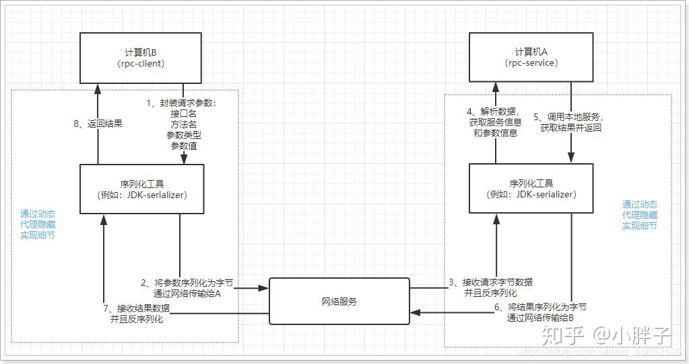

#  微服务

1. 什么是微服务？
2. 微服务中的单体、集群、微服务如何理解？
3. 微服务架构下，session共享问题。

## RPC

### 定义

RPC：一种跨越了应用层与传输层的协议，其本质就是一种如何调用远程方法(非本地方法)的解决方案，包括了**接口规范**+**序列化反序列化协议**+**通信协议**等。

> 基于HTTP的远程调用方案，效率低，有效信息占用比低，HTTP是第七层协议，传输信息中包含了大量HTTP协议本身的信息，封装和解析HTTP报文导致效率偏低。


### 执行过程

1. 调用方调用接口，通过动态代理技术为接口构造一个假的实现。
2. 动态代理接受到调用后，需要做：
   - 识别具体要调用的远程方法的机器IP，端口
   - 将**调用接口+调用方法+入参**序列化
   - 通过网络通信将序列化之后的请求发出去
3. 提供方接收到请求之后：
   - 反序列化请求
   - 定位到实际的调用方法，执行方法
   - 将方法结果返回



### 动态代理

代理：一种设计模式，通过代理对象来代替对真实对象的访问，这样就可以在不修改原目标对象的前提下，提供额外的功能操作，扩展目标对象的功能。

代理模式的主要作用是**扩展目标对象的功能**，比如说在目标对象的某个方法执行前后你可以增加一些自定义的操作。

##### JDK自带代理机制

**1. 静态代理**

静态代理中，对每个目标对象的方法增强都需要手动完成。

从 JVM 层面来说， **静态代理在编译时就将接口、实现类、代理类这些都变成了一个个实际的 class 文件。**

- 定义一个接口及其实现类

  ```java
  public interface SmsService {
      String send(String message);
  }
  
  public class SmsServiceImpl implements SmsService {
      public String send(String message) {
          System.out.println("send message:" + message);
          return message;
      }
  }
  ```

- 创建一个proxy类同样实现这个接口

  ```java
  public class SmsProxy implements SmsService {
  
      private final SmsService smsService;
  
      public SmsProxy(SmsService smsService) {
          this.smsService = smsService;
      }
  
      @Override
      public String send(String message) {
          //调用方法之前，我们可以添加自己的操作
          System.out.println("before method send()");
          smsService.send(message);
          //调用方法之后，我们同样可以添加自己的操作
          System.out.println("after method send()");
          return null;
      }
  }
  ```

- 在运行时，new一个目标类实例，new一个代理类实例(将目标类实例注入代理类)，调用代理类实例的方法（这个方法必须要是来自接口中定义的方法，其本质就是多态）

  ```java
  public class Main {
      public static void main(String[] args) {
          SmsService smsService = new SmsServiceImpl();
          //目标类注入代理类
          SmsProxy smsProxy = new SmsProxy(smsService);
          //代理类运行接口中定义的方法
          smsProxy.send("java");
      }
  }
  ```

  

总结：非常不灵活，接口一旦新增方法，目标对象和代理对象都需要修改，且对每个目标类都要单独写一个代理类。

**2. 动态代理**

### 序列化


### 网络通信协议


